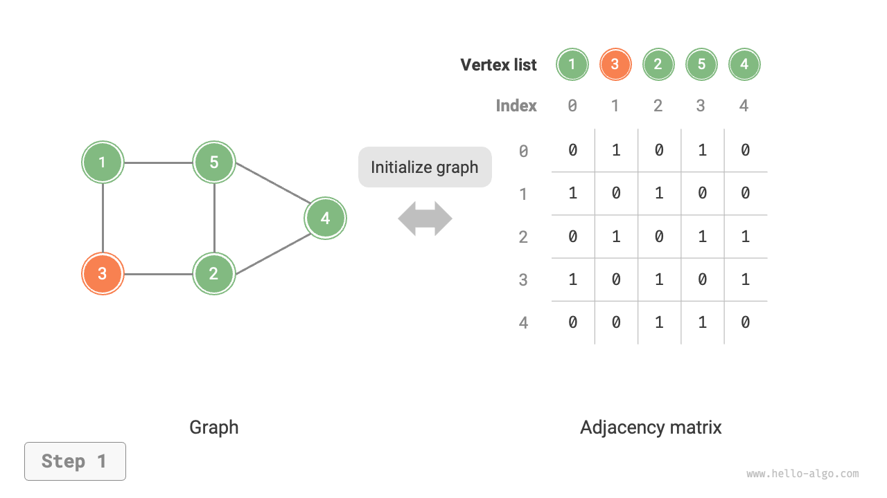
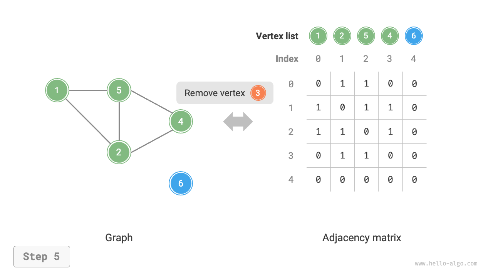
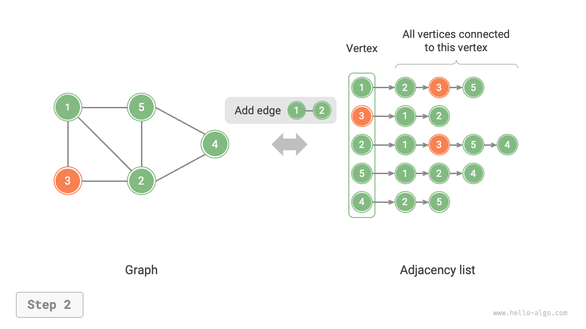
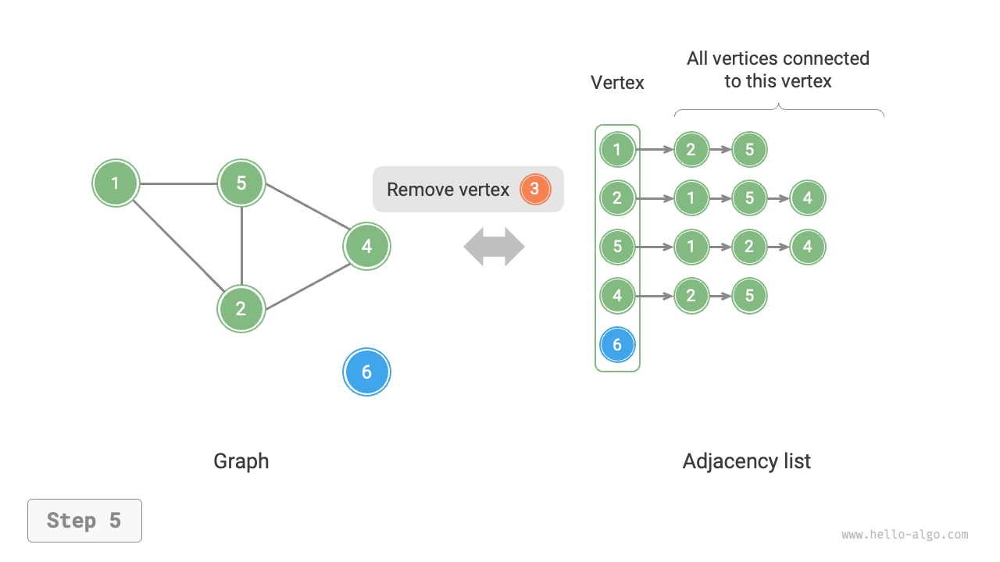

# Basic operations on graphs

The basic operations on graphs can be divided into operations on "edges" and operations on "vertices". Under the two representation methods of "adjacency matrix" and "adjacency list", the implementation methods are different.

## Implementation based on adjacency matrix

Given an undirected graph with $n$ vertices, the various operations are implemented as shown in the figure below.

- **Adding or removing an edge**: Directly modify the specified edge in the adjacency matrix, using $O(1)$ time. Since it is an undirected graph, it is necessary to update the edges in both directions simultaneously.
- **Adding a vertex**: Add a row and a column at the end of the adjacency matrix and fill them all with $0$s, using $O(n)$ time.
- **Removing a vertex**: Delete a row and a column in the adjacency matrix. The worst case is when the first row and column are removed, requiring $(n-1)^2$ elements to be "moved up and to the left", thus using $O(n^2)$ time.
- **Initialization**: Pass in $n$ vertices, initialize a vertex list `vertices` of length $n$, using $O(n)$ time; initialize an $n \times n$ size adjacency matrix `adjMat`, using $O(n^2)$ time.

=== "Initialize adjacency matrix"
    

=== "Add an edge"
    

=== "Remove an edge"
    

=== "Add a vertex"
    

=== "Remove a vertex"
    

Below is the implementation code for graphs represented using an adjacency matrix:

```src
[file]{graph_adjacency_matrix}-[class]{graph_adj_mat}-[func]{}
```

## Implementation based on adjacency list

Given an undirected graph with a total of $n$ vertices and $m$ edges, the various operations can be implemented as shown in the figure below.

- **Adding an edge**: Simply add the edge at the end of the corresponding vertex's linked list, using $O(1)$ time. Because it is an undirected graph, it is necessary to add edges in both directions simultaneously.
- **Removing an edge**: Find and remove the specified edge in the corresponding vertex's linked list, using $O(m)$ time. In an undirected graph, it is necessary to remove edges in both directions simultaneously.
- **Adding a vertex**: Add a linked list in the adjacency list and make the new vertex the head node of the list, using $O(1)$ time.
- **Removing a vertex**: It is necessary to traverse the entire adjacency list, removing all edges that include the specified vertex, using $O(n + m)$ time.
- **Initialization**: Create $n$ vertices and $2m$ edges in the adjacency list, using $O(n + m)$ time.

=== "Initialize adjacency list"
    

=== "Add an edge"
    

=== "Remove an edge"
    

=== "Add a vertex"
    

=== "Remove a vertex"
    

Below is the adjacency list code implementation. Compared to the figure above, the actual code has the following differences.

- For convenience in adding and removing vertices, and to simplify the code, we use lists (dynamic arrays) instead of linked lists.
- Use a hash table to store the adjacency list, `key` being the vertex instance, `value` being the list (linked list) of adjacent vertices of that vertex.

Additionally, we use the `Vertex` class to represent vertices in the adjacency list. The reason for this is: if, like with the adjacency matrix, list indexes were used to distinguish different vertices, then suppose you want to delete the vertex at index $i$, you would need to traverse the entire adjacency list and decrement all indexes greater than $i$ by $1$, which is very inefficient. However, if each vertex is a unique `Vertex` instance, then deleting a vertex does not require any changes to other vertices.

```src
[file]{graph_adjacency_list}-[class]{graph_adj_list}-[func]{}
```

## Efficiency comparison

Assuming there are $n$ vertices and $m$ edges in the graph, the table below compares the time efficiency and space efficiency of the adjacency matrix and adjacency list.

<p align="center"> Table <id> &nbsp; Comparison of adjacency matrix and adjacency list </p>

|                     | Adjacency matrix | Adjacency list (Linked list) | Adjacency list (Hash table) |
| ------------------- | ---------------- | ---------------------------- | --------------------------- |
| Determine adjacency | $O(1)$           | $O(m)$                       | $O(1)$                      |
| Add an edge         | $O(1)$           | $O(1)$                       | $O(1)$                      |
| Remove an edge      | $O(1)$           | $O(m)$                       | $O(1)$                      |
| Add a vertex        | $O(n)$           | $O(1)$                       | $O(1)$                      |
| Remove a vertex     | $O(n^2)$         | $O(n + m)$                   | $O(n)$                      |
| Memory space usage  | $O(n^2)$         | $O(n + m)$                   | $O(n + m)$                  |

Observing the table above, it seems that the adjacency list (hash table) has the best time efficiency and space efficiency. However, in practice, operating on edges in the adjacency matrix is more efficient, requiring only a single array access or assignment operation. Overall, the adjacency matrix exemplifies the principle of "space for time", while the adjacency list exemplifies "time for space".
