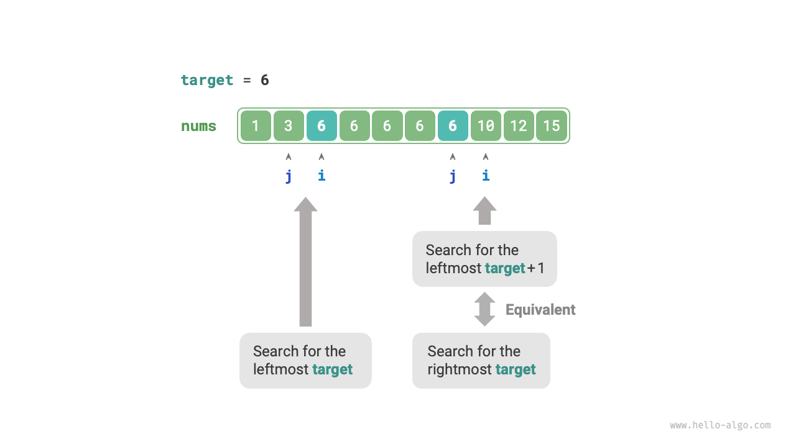

# Binary search boundaries

## Find the left boundary

!!! question

    Given a sorted array `nums` of length $n$, which may contain duplicate elements, return the index of the leftmost element `target`. If the element is not present in the array, return $-1$.

Recall the method of binary search for an insertion point, after the search is completed, $i$ points to the leftmost `target`, **thus searching for the insertion point is essentially searching for the index of the leftmost `target`**.

Consider implementing the search for the left boundary using the function for finding an insertion point. Note that the array might not contain `target`, which could lead to the following two results:

- The index $i$ of the insertion point is out of bounds.
- The element `nums[i]` is not equal to `target`.

In these cases, simply return $-1$. The code is as follows:

```src
[file]{binary_search_edge}-[class]{}-[func]{binary_search_left_edge}
```

## Find the right boundary

So how do we find the rightmost `target`? The most straightforward way is to modify the code, replacing the pointer contraction operation in the case of `nums[m] == target`. The code is omitted here, but interested readers can implement it on their own.

Below we introduce two more cunning methods.

### Reusing the search for the left boundary

In fact, we can use the function for finding the leftmost element to find the rightmost element, specifically by **transforming the search for the rightmost `target` into a search for the leftmost `target + 1`**.

As shown in the figure below, after the search is completed, the pointer $i$ points to the leftmost `target + 1` (if it exists), while $j$ points to the rightmost `target`, **thus returning $j$ is sufficient**.



Please note, the insertion point returned is $i$, therefore, it should be subtracted by $1$ to obtain $j$:

```src
[file]{binary_search_edge}-[class]{}-[func]{binary_search_right_edge}
```

### Transforming into an element search

We know that when the array does not contain `target`, $i$ and $j$ will eventually point to the first element greater and smaller than `target` respectively.

Thus, as shown in the figure below, we can construct an element that does not exist in the array, to search for the left and right boundaries.

- To find the leftmost `target`: it can be transformed into searching for `target - 0.5`, and return the pointer $i$.
- To find the rightmost `target`: it can be transformed into searching for `target + 0.5`, and return the pointer $j$.


The code is omitted here, but two points are worth noting.

- The given array does not contain decimals, meaning we do not need to worry about how to handle equal situations.
- Since this method introduces decimals, the variable `target` in the function needs to be changed to a floating point type (no change needed in Python).
