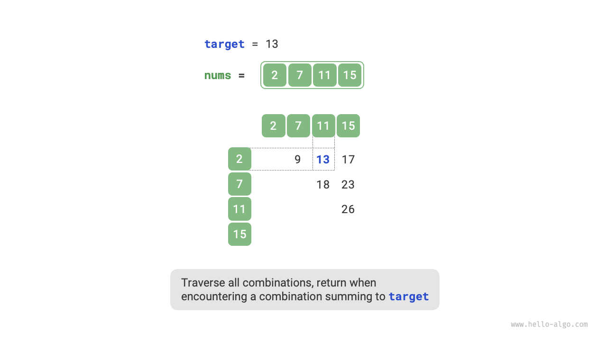
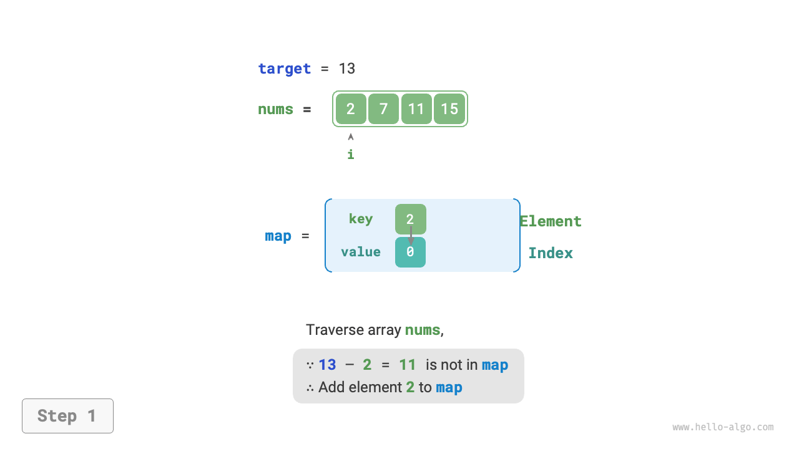
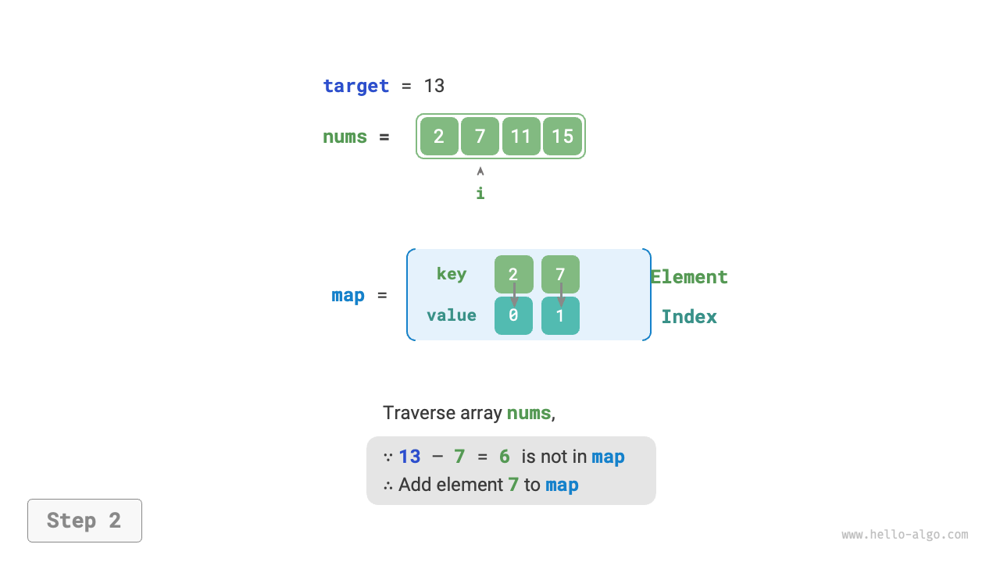

# Hash optimization strategies

In algorithm problems, **we often reduce the time complexity of algorithms by replacing linear search with hash search**. Let's use an algorithm problem to deepen understanding.

!!! question

    Given an integer array `nums` and a target element `target`, please search for two elements in the array whose "sum" equals `target`, and return their array indices. Any solution is acceptable.

## Linear search: trading time for space

Consider traversing all possible combinations directly. As shown in the figure below, we initiate a two-layer loop, and in each round, we determine whether the sum of the two integers equals `target`. If so, we return their indices.



The code is shown below:

```src
[file]{two_sum}-[class]{}-[func]{two_sum_brute_force}
```

This method has a time complexity of $O(n^2)$ and a space complexity of $O(1)$, which is very time-consuming with large data volumes.

## Hash search: trading space for time

Consider using a hash table, with key-value pairs being the array elements and their indices, respectively. Loop through the array, performing the steps shown in the figure below each round.

1. Check if the number `target - nums[i]` is in the hash table. If so, directly return the indices of these two elements.
2. Add the key-value pair `nums[i]` and index `i` to the hash table.

=== "<1>"
    

=== "<2>"
    

=== "<3>"
    

The implementation code is shown below, requiring only a single loop:

```src
[file]{two_sum}-[class]{}-[func]{two_sum_hash_table}
```

This method reduces the time complexity from $O(n^2)$ to $O(n)$ by using hash search, greatly improving the running efficiency.

As it requires maintaining an additional hash table, the space complexity is $O(n)$. **Nevertheless, this method has a more balanced time-space efficiency overall, making it the optimal solution for this problem**.
