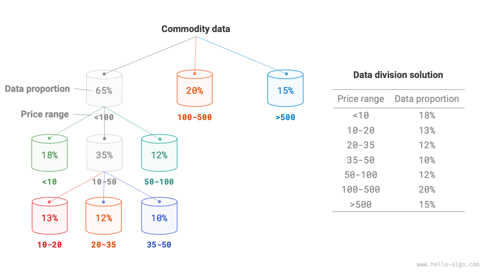

# Bucket sort

The previously mentioned sorting algorithms are all "comparison-based sorting algorithms," which sort by comparing the size of elements. Such sorting algorithms cannot surpass a time complexity of $O(n \log n)$. Next, we will discuss several "non-comparison sorting algorithms" that can achieve linear time complexity.

<u>Bucket sort</u> is a typical application of the divide-and-conquer strategy. It involves setting up a series of ordered buckets, each corresponding to a range of data, and then distributing the data evenly among these buckets; each bucket is then sorted individually; finally, all the data are merged in the order of the buckets.

## Algorithm process

Consider an array of length $n$, with elements in the range $[0, 1)$. The bucket sort process is illustrated in the figure below.

1. Initialize $k$ buckets and distribute $n$ elements into these $k$ buckets.
2. Sort each bucket individually (using the built-in sorting function of the programming language).
3. Merge the results in the order from the smallest to the largest bucket.


The code is shown as follows:

```src
[file]{bucket_sort}-[class]{}-[func]{bucket_sort}
```

## Algorithm characteristics

Bucket sort is suitable for handling very large data sets. For example, if the input data includes 1 million elements, and system memory limitations prevent loading all the data at once, you can divide the data into 1,000 buckets and sort each bucket separately before merging the results.

- **Time complexity is $O(n + k)$**: Assuming the elements are evenly distributed across the buckets, the number of elements in each bucket is $n/k$. Assuming sorting a single bucket takes $O(n/k \log(n/k))$ time, sorting all buckets takes $O(n \log(n/k))$ time. **When the number of buckets $k$ is relatively large, the time complexity tends towards $O(n)$**. Merging the results requires traversing all buckets and elements, taking $O(n + k)$ time.
- **Adaptive sorting**: In the worst case, all data is distributed into a single bucket, and sorting that bucket takes $O(n^2)$ time.
- **Space complexity is $O(n + k)$, non-in-place sorting**: It requires additional space for $k$ buckets and a total of $n$ elements.
- Whether bucket sort is stable depends on whether the algorithm used to sort elements within the buckets is stable.

## How to achieve even distribution

The theoretical time complexity of bucket sort can reach $O(n)$, **the key is to evenly distribute the elements across all buckets**, as real data is often not uniformly distributed. For example, if we want to evenly distribute all products on Taobao by price range into 10 buckets, but the distribution of product prices is uneven, with many under 100 yuan and few over 1000 yuan. If the price range is evenly divided into 10, the difference in the number of products in each bucket will be very large.

To achieve even distribution, we can initially set a rough dividing line, roughly dividing the data into 3 buckets. **After the distribution is complete, the buckets with more products can be further divided into 3 buckets, until the number of elements in all buckets is roughly equal**.

As shown in the figure below, this method essentially creates a recursive tree, aiming to make the leaf node values as even as possible. Of course, you don't have to divide the data into 3 buckets each round; the specific division method can be flexibly chosen based on data characteristics.



If we know the probability distribution of product prices in advance, **we can set the price dividing line for each bucket based on the data probability distribution**. It is worth noting that it is not necessarily required to specifically calculate the data distribution; it can also be approximated based on data characteristics using some probability model.

As shown in the figure below, we assume that product prices follow a normal distribution, allowing us to reasonably set the price intervals, thereby evenly distributing the products into the respective buckets.


