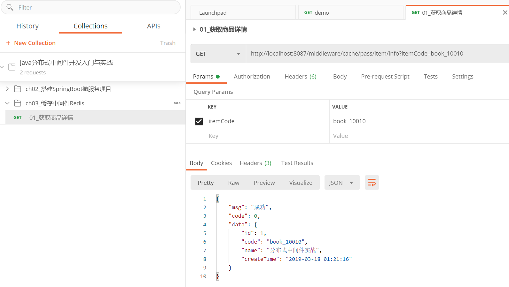

## 3.1 RedisTemplate实战

### 3.1.1 字符串信息写入缓存中

```java
public void one() {
    log.info("------开始RedisTemplate操作组件实战----");

    //定义字符串内容以及存入缓存的key
    final String content = "RedisTemplate实战字符串信息";
    final String key = "redis:template:one:string";

    //Redis通用的操作组件
    ValueOperations valueOperations = redisTemplate.opsForValue();

    //将字符串信息写入缓存中
    log.info("写入缓存中的内容：{} ", content);
    valueOperations.set(key, content);

    //从缓存中读取内容
    Object result = valueOperations.get(key);
    log.info("读取出来的内容：{} ", result);
}
```

 

### 3.1.2 对象信息序列化为JSON格式字符串后写入缓存中

```java
 public void two() throws Exception {
     log.info("------开始RedisTemplate操作组件实战----");

     // 构造对象信息
     User user = new User(1, "debug", "阿修罗");

     // Redis通用的操作组件
     ValueOperations valueOperations = redisTemplate.opsForValue();

     // 将序列化后的信息写入缓存中
     final String key = "redis:template:two:object";
     final String content = objectMapper.writeValueAsString(user);

     valueOperations.set(key, content);
     log.info("写入缓存对象的信息：{} ", user);

     // 从缓存中读取内容
     Object result = valueOperations.get(key);
     if (result != null) {
         User resultUser = objectMapper.readValue(result.toString(), User.class);
         log.info("读取缓存内容并反序列化后的结果：{} ", resultUser);
     }
 }
```


## 3.2 StringRedisTemplate实战

### 3.2.1 StringRedisTemplate

```java
public void three() {
    log.info("------开始StringRedisTemplate操作组件实战----");

    // 定义字符串内容以及存入缓存的key
    final String content = "StringRedisTemplate实战字符串信息";
    final String key = "redis:three";

    // Redis通用的操作组件
    ValueOperations valueOperations = stringRedisTemplate.opsForValue();

    // 将字符串信息写入缓存中
    log.info("写入缓存中的内容：{} ", content);
    valueOperations.set(key, content);

    // 从缓存中读取内容
    Object result = valueOperations.get(key);
    log.info("读取出来的内容：{} ", result);
}
```


 

### 3.2.2 StringRedisTemplate JSON

```java
public void four() throws Exception {
    log.info("------开始StringRedisTemplate操作组件实战----");

    //构造对象信息
    User user = new User(2, "SteadyJack", "阿修罗");

    //Redis通用的操作组件
    ValueOperations valueOperations = redisTemplate.opsForValue();

    //将序列化后的信息写入缓存中
    final String key = "redis:four";
    final String content = objectMapper.writeValueAsString(user);

    valueOperations.set(key, content);
    log.info("写入缓存对象的信息：{} ", user);

    //从缓存中读取内容
    Object result = valueOperations.get(key);
    if (result != null) {
        User resultUser = objectMapper.readValue(result.toString(), User.class);
        log.info("读取缓存内容并反序列化后的结果：{} ", resultUser);
    }
}
```


## 3.3 Redis常见数据类型实战

### 3.3.1　字符串

1. 源代码 

```java
@Test
public void one() throws Exception {
    //构造用户个人实体对象
    Person p = new Person(10013, 23, "修罗", "debug", "火星");

    //定义key与即将存入缓存中的value
    final String key = "redis:test:1";
    String value = objectMapper.writeValueAsString(p);

    //写入缓存中
    log.info("存入缓存中的用户实体对象信息为：{} ", p);
    redisTemplate.opsForValue().set(key, value);

    //从缓存中获取用户实体信息
    Object res = redisTemplate.opsForValue().get(key);
    if (res != null) {
        Person resP = objectMapper.readValue(res.toString(), Person.class);
        log.info("从缓存中读取信息：{} ", resP);
    }
}
```

2. 运行结果


### 3.3.2　列表

1. 源代码 

```java
public void two() throws Exception {
    //构造已经排好序的用户对象列表
    List<Person> list = new ArrayList<>();
    list.add(new Person(1, 21, "修罗", "debug", "火星"));
    list.add(new Person(2, 22, "大圣", "jack", "水帘洞"));
    list.add(new Person(3, 23, "盘古", "Lee", "上古"));
    log.info("构造已经排好序的用户对象列表: {} ", list);

    //将列表数据存储至Redis的List中
    final String key = "redis:test:2";
    ListOperations listOperations = redisTemplate.opsForList();
    for (Person p : list) {
        //往列表中添加数据-从队尾中添加
        listOperations.leftPush(key, p);
    }

    //获取Redis中List的数据-从队头中获取
    log.info("--获取Redis中List的数据-从队头中获取--");
    Object res = listOperations.rightPop(key);
    Person resP;
    while (res != null) {
        resP = (Person) res;
        log.info("当前数据：{} ", resP);
        res = listOperations.rightPop(key);
    }
}
```

2. 运行结果


### 3.3.3　集合

1. 源代码 

```java
public void three() throws Exception {
    //构造一组用户姓名列表
    List<String> userList = new ArrayList<>();
    userList.add("debug");
    userList.add("jack");
    userList.add("修罗");
    userList.add("大圣");
    userList.add("debug");
    userList.add("jack");
    userList.add("steadyheart");
    userList.add("修罗");
    userList.add("大圣");

    log.info("待处理的用户姓名列表：{} ", userList);

    //遍历访问，剔除相同姓名的用户并塞入集合中，最终存入缓存中
    final String key = "redis:test:3";
    SetOperations setOperations = redisTemplate.opsForSet();
    for (String str : userList) {
        setOperations.add(key, str);
    }

    //从缓存中获取已剔除的用户集合
    Object res = setOperations.pop(key);
    while (res != null) {
        log.info("从缓存中获取的用户集合-当前用户：{} ", res);
        res = setOperations.pop(key);
    }
}
```

2. 运行结果


### 3.3.4　有序集合

1. 源代码 

```java
public void four() throws Exception {
    // 构造一组无序的用户手机充值对象列表
    List<PhoneUser> list = new ArrayList<>();
    list.add(new PhoneUser("103", 130.0));
    list.add(new PhoneUser("101", 120.0));
    list.add(new PhoneUser("102", 80.0));
    list.add(new PhoneUser("105", 70.0));
    list.add(new PhoneUser("106", 50.0));
    list.add(new PhoneUser("104", 150.0));
    log.info("构造一组无序的用户手机充值对象列表:{}", list);

    // 遍历访问充值对象列表，将信息塞入Redis的有序集合中
    final String key = "redis:test:4";
    // 因为zSet在add元素进入缓存后，下次就不能进行更新了，故而为了测试方便,
    // 进行操作之前先清空该缓存(当然实际生产环境中不建议这么使用)
    redisTemplate.delete(key);

    ZSetOperations zSetOperations = redisTemplate.opsForZSet();
    for (PhoneUser u : list) {
        zSetOperations.add(key, u, u.getFare());
    }

    // 前端获取访问充值排名靠前的用户列表
    Long size = zSetOperations.size(key);
    // 从小到大排序
    Set<PhoneUser> resSet = zSetOperations.range(key, 0L, size);
    // 从大到小排序
    //Set<PhoneUser> resSet=zSetOperations.reverseRange(key,0L,size);
    for (PhoneUser u : resSet) {
        log.info("从缓存中读取手机充值记录排序列表，当前记录：{} ", u);
    }
}
```

2. 运行结果


### 3.3.5　哈希存储

1. 源代码 

```java
public void five() throws Exception {
    // 构造学生对象列表，水果对象列表
    List<Student> students = new ArrayList<>();
    List<Fruit> fruits = new ArrayList<>();

    students.add(new Student("10010", "debug", "大圣"));
    students.add(new Student("10011", "jack", "修罗"));
    students.add(new Student("10012", "sam", "上古"));

    fruits.add(new Fruit("apple", "红色"));
    fruits.add(new Fruit("orange", "橙色"));
    fruits.add(new Fruit("banana", "黄色"));

    // 分别遍历不同对象队列，并采用Hash哈希存储至缓存中
    final String sKey = "redis:test:5";
    final String fKey = "redis:test:6";

    HashOperations hashOperations = redisTemplate.opsForHash();
    for (Student s : students) {
        hashOperations.put(sKey, s.getId(), s);
    }
    for (Fruit f : fruits) {
        hashOperations.put(fKey, f.getName(), f);
    }

    // 获取学生对象列表与水果对象列表
    Map<String, Student> sMap = hashOperations.entries(sKey);
    log.info("获取学生对象列表：{} ", sMap);

    Map<String, Fruit> fMap = hashOperations.entries(fKey);
    log.info("获取水果对象列表：{} ", fMap);

    // 获取指定的学生对象、水果对象
    String sField = "10012";
    Student s = (Student) hashOperations.get(sKey, sField);
    log.info("获取指定的学生对象：{} -> {} ", sField, s);

    String fField = "orange";
    Fruit f = (Fruit) hashOperations.get(fKey, fField);
    log.info("获取指定的水果对象：{} -> {} ", fField, f);
}
```

2. 运行结果


### 3.3.6　Key失效与判断是否存在

1. 源代码 

```java
public void six() throws Exception {
    // 构造key与redis操作组件
    final String key1 = "redis:test:6";
    ValueOperations valueOperations = redisTemplate.opsForValue();

    // 第一种方法：在往缓存中set数据时,提供一个ttl,表示ttl时间一到,缓存中的key将自动失效,即被清理
    // 在这里TTL是10秒
    valueOperations.set(key1, "expire操作", 10L, TimeUnit.SECONDS);

    // 等待5秒-判断key是否还存在
    Thread.sleep(5000);
    Boolean existKey1 = redisTemplate.hasKey(key1);
    Object value = valueOperations.get(key1);
    log.info("等待5秒-判断key是否还存在:{} 对应的值:{}", existKey1, value);

    // 再等待5秒-再判断key是否还存在
    Thread.sleep(5000);
    existKey1 = redisTemplate.hasKey(key1);
    value = valueOperations.get(key1);
    log.info("再等待5秒-再判断key是否还存在:{} 对应的值:{}", existKey1, value);
}
```

2. 运行结果

 


3. 源代码 

```java
public void seven() throws Exception {
    // 构造key与redis操作组件
    final String key2 = "redis:test:7";
    ValueOperations valueOperations = redisTemplate.opsForValue();

    // 第二种方法：在往缓存中set数据后,采用redisTemplate的expire方法失效该key
    valueOperations.set(key2, "expire操作-2");
    redisTemplate.expire(key2, 10L, TimeUnit.SECONDS);

    // 等待5秒-判断key是否还存在
    Thread.sleep(5000);
    Boolean existKey = redisTemplate.hasKey(key2);
    Object value = valueOperations.get(key2);
    log.info("等待5秒-判断key是否还存在:{} 对应的值:{}", existKey, value);

    // 再等待5秒-再判断key是否还存在
    Thread.sleep(5000);
    existKey = redisTemplate.hasKey(key2);
    value = valueOperations.get(key2);
    log.info("再等待5秒-再判断key是否还存在:{} 对应的值:{}", existKey, value);
}
```

4. 运行结果

 


## 3.4 Redis实战场景之缓存穿透

### 3.4.3　未穿透

1. 源代码 

>  




#### 缓存穿透


3. 解决后的响应结果

 

4. 日志


# END