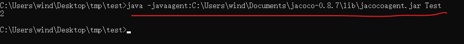
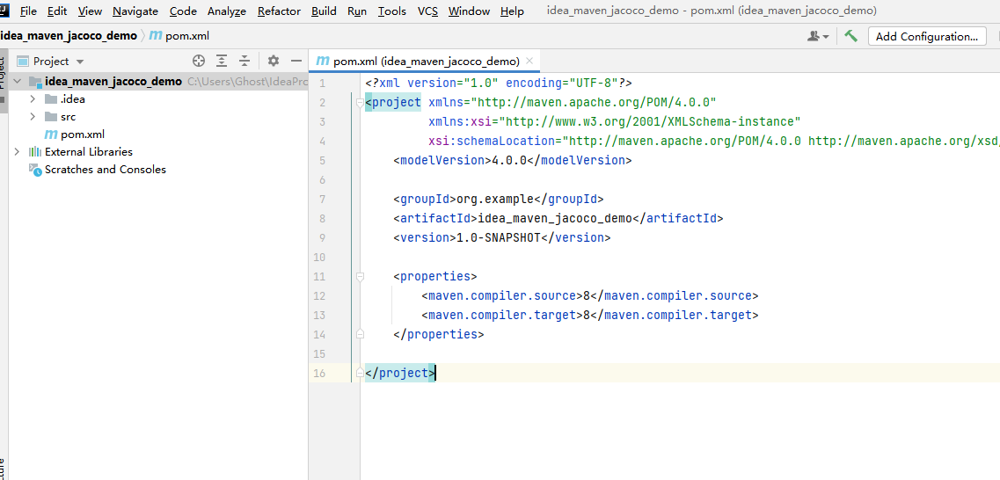
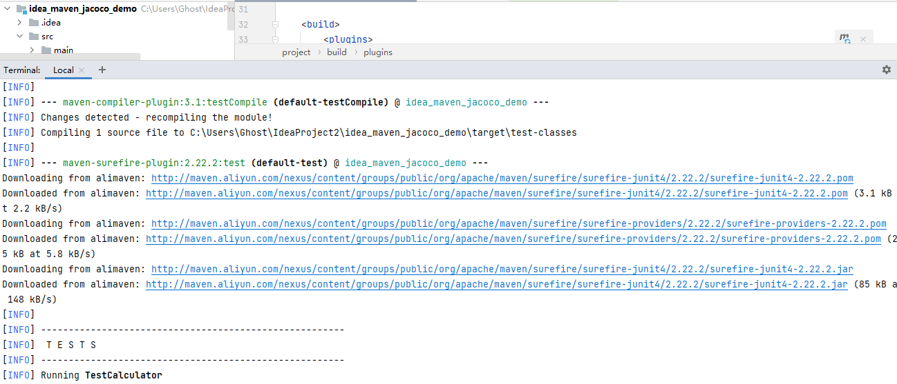

# 持续集成项目实战-静态代码扫描持续集成

## 1 SonarQube介绍和安装

SonarQube®是一种自动代码审查工具，用于检测代码中的错误、漏洞和代码异味(不稳定代码)。它可以与您现有的工作流集成，以支持跨项目分支和请求的连续代码检查。

官网介绍链接：https://www.shcsinfo.com/


SonarQube本质上是一个Web网站，主要是展现扫描的结果。

而扫描主要是通过Sonar Scanner完成的。

### 1.1 SonarQube的作用 

在软件开发过程中，经常出现开发编写的代码命名不规范、代码重复、代码有显而易见的逻辑异常等问题，虽然团队内部可以通过代码走读发现一部分问题，但是对于大型项目，经常开发代码走读是一件费时费力的事情。

所以我们可以通过自动化工具，把要检查的语法规则整合起来，从而实现自动扫描代码，自动发现代码问题的作用。提升开发编写代码的质量和技术水平。

* 检查代码编写上是否符合规范设计

  命名规范、注释规范、缩进排版规范、文件名规范、声明规范、语句规范以及编程规范。

* 检查代码是否有Bug

* SonarQube提供了OWASP top10和SANS top25的安全扫描

  从而可以很直观的发现项目中比较严重的安全漏洞

缺点：发现的漏洞可能需要较大的时间成本去校验和修复

例如：远程代码可执行漏洞发现后，我们要验证的话，需要按照提示，学习对应的攻击方法，然后进行攻击验证。

所以这项工作也会有专门的“安全测试工程师”进行测试、验证和修复。


### 1.2 OWASP安全体系介绍

OWASP安全体系是进行渗透测试必须知道的体系知识，它提供了目前市场上最常见的安全问题，从而帮忙企业快速解决常见安全漏洞，提升产品的安全性。


owasp官网

 

项目成员，主要是对OWASP提供的TOP10安全漏洞进行检查，从而发现程序是否具有安全漏洞

Web安全漏洞TOP10

```text
Top 10 Web Application Security Risks
A1:2017-Injection
A2:2017-Broken Authentication
A3:2017-Sensitive Data Exposure
A4:2017-XML External Entities (XXE)
A5:2017-Broken Access Control
A6:2017-Security Misconfiguration
A7:2017-Cross-Site Scripting XSS
A8:2017-Insecure Deserialization
A9:2017-Using Components with Known Vulnerabilities
A10:2017-Insufficient Logging & Monitoring
```

移动端安全漏洞TOP10

```text
Top 10 Mobile Risks - Final List 2016
M1: Improper Platform Usage
M2: Insecure Data Storage
M3: Insecure Communication
M4: Insecure Authentication
M5: Insufficient Cryptography
M6: Insecure Authorization
M7: Client Code Quality
M8: Code Tampering
M9: Reverse Engineering
M10: Extraneous Functionality
```

OWASP列出了常见的安全漏洞检查事项，这样安全人员可以根据这些CheckList来检查程序是否存在漏洞，从而提升项目安全等级。

### 1.3 SonarQube用法

 

* 开发编写代码提交代码到代码仓库
* Checkout 下载代码到Jenkins
* 静态代码扫描、单元测试
* SonarQube收集结果，并进行展示

SonarQube扫描方法

* 通过jenkins插件调用Sonar Scanner
* SonarQube Scanner
  使用Scanner，通过配置文件，修改项目信息，在命令行中调用scanner工具，进行扫描，并推送给sonarqube
* Maven、Gradle等内置扫描器
  以maven为例，需要修改maven和sonarqube配置文件，在mvn编译后，使用mvn命令，进行代码扫描，并推送给sonarqube（需要编译源代码）


SonarQube扫描的维度

```
1、不遵循代码标准
    sonar可以通过PMD，CheckStyle，Findbugs等代码规则检测工具规范代码编写
2、潜在的缺陷
    sonar可以通过PMD，CheckStyle，Findbugs等代码规则检测工具检测出潜在的缺陷 
3、糟糕的复杂度分布
    文件、类、方法等，如果复杂度过高将难以改变，这会使得开发人员难以理解它们，且没有自动化的单元测试，对于程序中的任何组件的改变都将可能导致需要全面的回归测试
4、重复
    显然程序中包含大量复制粘贴的代码是质量低下的，sonar可以展示源码中重复严重的地方
5、注释不足或者过多
    没有注释将使代码可读性变差，特别是当不可避免出现人员变动时，程序的可读性大幅度下降，而过多的注释又会使得开发人员将奖励过多的花费在阅读注释上，亦违背初衷
6、缺乏单元测试
     sonar可以很方便地统计并展示单元测试覆盖率
7、糟糕的设计
    通过sonar可以找出循环，展示包与包、类与类之间相互依赖关系，可以检测自定义的架构规则 通过sonar可以管理第三方的jar包，可以利用LCOM4检测单个任务规则的应用情况，检测耦合。
```

### 1.4 SonarQube安装

#### 1.3.1 下载SonarQube

SonarQube版本：9.0.3

https://www.sonarqube.org/downloads/

1.3.2 安装条件

https://docs.sonarqube.org/latest/requirements/requirements/

 


 

 

 


#### 1.3.2 安装JDK


```
# 拷贝到 /home 目录下，然后进入 home 文件夹
cd home
# 解压gz文件
tar -xvf jdk-11.0.12_linux-x64_bin.tar.gz
# 将解压后的文件夹移动到 /usr/local 下
mv jdk-11.0.12 /usr/local
```

 


 


```
JAVA_HOME=/usr/local/jdk-11.0.12

export PATH=$PATH:$JAVA_HOME/bin

[root@localhost local]# source /etc/profile
[root@localhost local]# java -version
```

 

```
echo $PATH
```

 

#### 1.3.2 安装PostgresSQL

下载：https://www.enterprisedb.com/downloads/postgres-postgresql-downloads

 

**Windows安装**


双击，按照默认方式安装

**Mac OS安装**

下载Mac OS X的安装包，

然后双击运行，把安装的应用程序拖入Application

**Linux 安装**

下载：https://www.postgresql.org/ftp/source/

下载源码，通过编译的方式安装


步骤：

解压，

cd进入解压目录，

chmod 755 * 授权,

./configuration,

make && makeinstall 

完成


**启动server** 

**Linux启动命令：**

```text
postgres -D /usr/local/pgsql/data >logfile 2>&1 &
```

**Windows：**

运行pg_ctl.exe

**Mac OS：**

```text
initdb /usr/local/var/postgres -E utf8
```

#### 1.3.3 配置SonarQube


```
# 创建用户名和密码
create user sonar with password 'sonar';
create database sonar owner sonar;
grant all privileges on database sonar to sonar;
```

 

```


docker run -d --name sonarqube --restart=always \
-p 9000:9000 \
-e sonar.jdbc.username=sonar \
-e sonar.jdbc.password=sonar \
-e sonar.jdbc.url=jdbc:postgresql://192.168.3.122:25432/sonar \
sonarqube:9.1.0-community
————————————————
版权声明：本文为CSDN博主「naumy」的原创文章，遵循CC 4.0 BY-SA版权协议，转载请附上原文出处链接及本声明。
原文链接：https://blog.csdn.net/naumy/article/details/120677544


http://192.168.3.122:9000

http://192.168.3.122:9000/projects

admin / Xulin486
```


配置{sonar安装目录}\conf\sonar.properties

```text
#Configure here general information about the environment, such as SonarQube server connection details for example
#No information about specific project should appear here

#----- Default SonarQube server
#sonar.host.url=http://localhost:9000

#----- Default source code encoding
#sonar.sourceEncoding=UTF-8

sonar.host.url=http://localhost:9000
sonar.sourceEncoding=UTF-8
sonar.jdbc.url=jdbc:postgresql://localhost:5432/sonarqube?currentSchema=public
sonar.jdbc.username=postgres
sonar.jdbc.password=123456

# sonarqube web登陆用户名和密码
sonar.login=admin
sonar.password=123456
```

配置数据库

```text
psql -h localhost -p 5432 -d postgres -U postgres
密码是：123456

CREATE DATABASE sonarqube;
```

#### 1.3.4 Sonnar-Scanner

SonarQube是一个Web网站，主要用于展示代码扫描的结果，静态扫描代码时，主要是通过Sonar-Scanner进行

Sonnar-Scanner主要包括三个部分，分别是

* SonarScannerApi：主要用来下载插件包和加载类

* SonarScannerCli：用来执行命令和接收命令的参数

* SonarScannerEngine：真正用来执行扫描

  执行步骤：

  * 获取已有插件列表

  * 获取规则配置和可用规则

  * 执行插件中的规则

  * 问题记录和报告上传(java为例)

**规则**

Sonnar-Scanner扫描时，会按照获取的规则对代码进行对比检查，从而发现Bug、漏洞、代码异味等问题。

例如：开发内部规定，程序变量、方法、类的命名都必须使用驼峰命名法，那么我们可以根据驼峰命名法创建能匹配驼峰命名的规则，然后按照该规则扫描所有变量、方法、类名（python、java都会把变量、方法名、类名等元素保存集中管理，所以Sonnar-Scanner可以利用该特性找出所有名称，进行扫描）

一旦发现不符合正则匹配规则的命名方式，那么就会抛出警告或者异常

#### 1.3.5 SonarQube入门示例 

* 准备源代码


* 在源代码项目下，新增一个sonar-project.properties文件

```text

# 指定SonarQube instance必须是唯一的
sonar.projectKey=MySonar1
# 设置SonarQube UI显示的名称
sonar.projectName=MySonar1
sonar.projectVersion=1.0
sonar.language=java
# 指定src和classes文件夹位置(从当前工作空间导入)
sonar.sources=src/main
sonar.test=src/test
sonar.java.binaries=target
# 下面的这两个参数作用是相同的，因为有时我们需要指定某个文件夹或者忽略某个文件夹
# sonar.inclusions=src/**,src/**
# sonar.exclusions=src/**,src/**
# 源码编码，默认是系统编码
sonar.sourceEncoding=UTF-8
# Set jacoco Configuration
# 指定代码覆盖率工具
sonar.core.codeCoveragePlugin=jacoco
# 指定exec二进制文件存放路径
sonar.jacoco.reportPaths=target/coverage-reports/jacoco-unit.exec
# 以下属性可选择性加，当然也可以不加
sonar.dynamicAnalysis=reuseReports
sonar.jacoco.reportMissing.force.zero=false
# 指定加载xml报告的路径，查看的HTML报告会根据这个报告生成
sonar.coverage.jacoco.xmlReportPaths=target/site/jacoco.xml
```

* 修改


## 2 SonarQube+JaCoco+Maven静态代码扫描

### 2.1 Jacoco介绍、安装和使用

#### 2.1.1 Jacoco介绍

Jacoco是一个开源的代码覆盖率工具，可以嵌入到Ant 、Maven中，并提供了EclEmma Eclipse插件,也可以使用JavaAgent技术监控Java程序。很多第三方的工具提供了对Jacoco的集成，如sonar、Jenkins等。


**代码覆盖率**： 指源代码被测试的比例和程度，通常用来表示代码被测试的充分程度。

公司会用代码覆盖率来考核测试任务完成情况，例如执行测试(单元测试、功能测试等)之后，代码覆盖率需要达到90%作为测试是否通过的标准之一

**使用Jacoco的作用**

监测应用程序在测试时有多少源码被执行。

包括：单元测试、功能测试、接口测试

代码覆盖的意义：

**代码覆盖率的意义**

1、分析未覆盖部分的代码，从而反推在前期测试设计是否充分。

2、检测出程序中的废代码，可以逆向反推在代码设计中思维混乱点，提醒设计/开发人员理清代码逻辑关系，提升代码质量。
3、代码覆盖率高不能说明代码质量高，但是反过来看，代码覆盖率低，代码质量不会高到哪里去，可以作为测试自我审视的重要工具之一。

**Jacoco代码覆盖率的方法**

官网参考：https://www.jacoco.org/jacoco/trunk/doc/counters.html

 

* 行覆盖

  所有类文件均携带debug信息进行编译，则可以通过统计Debug信息计算每行的覆盖率，当至少一个指令被指定到源码行且已执行时，则可认为该行代码已经被执行。

  未被覆盖：红色标志

  部分覆盖：黄色标志

  全部覆盖：绿色标志

* 类覆盖

  该类中，有一个方法被执行时，则认为这个类已经被覆盖了

* 方法覆盖

  每个非抽象方法至少包含一个指令，当至少一个指令被执行，该方法被认为已执行

* 分支覆盖(C1 Coverage)

  Jacoco为if和switch语句计算分支覆盖率。这个指标计算一个方法中的分支总数，并统计已执行和未执行的分支的数量，分支覆盖率在class文件中缺少debug信息时也可使用，但是异常处理不在分支覆盖的统计范围内。

* 指令覆盖(C0 Coverage)

  Jacoco计数的最小单元是Java字节码指令，它为执行/未执行代码提供了大量的信息。这个指标完全独立于源格式，在类文件中缺少debug信息时也可以使用

* 圈复杂度

  Jacoco对每个非抽象方法计算圈复杂度，总结类、包、组的复杂性。

  圈复杂度V(G)是基于方法的控制流图的有向图表示：V(G) = E - N + 2

  其中E是边界，N是节点数量

  所以下图中的V(G) = 9 - 8 + 2 = 3 

  *所有终点只计算一次，即便有多个return或者throw节点对应代码中的分支语句*

  

  

  JaCoCo根据分支数（B）和决策点数（D），使用以下等效方程计算方法的圈复杂度：

  v（G）=B-D+1

  圈复杂度越高，意味着代码越复杂，越难以维护，所需要充分的测试用例数据越多。

**Jacoco实现覆盖的底层原理**

* on the fly模式

  JVM通过 -javaagent参数指定jar文件启动代理程序，代理程序在ClassLoader装载一个class前判断是否修改class文件，并将探针插入class文件，探针不改变原有方法的行为，只是记录是否已经执行。

  

  on the fly模式主要是加载类时，注入探针，所以可以实时统计覆盖率。

  例如：我们假设我们的程序有100个类，注册时内部使用3个类，登陆时内部使用2个类。那么我们注册时，jacoco会先注入探针，然后根据我们的注册方式，判断代码经过的链路（类覆盖、行覆盖、方法覆盖等），

  从而得出覆盖率；如果我们采用不同的数据进行注册，那么由于之前已经注入了探针，所以不会重复注入，而是继续统计）

  

* offline模式

  在测试之前先对文件进行插桩，生成插过桩的class或jar包，测试插过桩的class和jar包，生成覆盖率信息到文件，最后统一处理，生成报告。

  *注意：安卓应用只适合offline模式，主要是因为字节码必须经过支持Android Dalvik等专用虚拟机处理，所以字节码必须在虚拟机处理之前完成，也就是offline模式；* 


区别：

* On-The-Fly模式更加方便的获取代码覆盖率，无需提前进行字节码插桩，可以实时获取代码覆盖率信息
* Offline模式适用于以下场景：
            运行环境不支持java agent
            部署环境不允许设置JVM参数
            字节码需要被转换成其他虚拟机字节码，如Android Dalvik VM
            动态修改字节码过程中和其他agent冲突
            无法自定义用户加载类

**Jacoco的工作原理**

下图是一个字节码指令集被插桩的过程分析


Jacoco支持的代码扫描技术

绿色部分是Jacoco推荐的方式


**Jacoco的使用方法**

- Ant

  通过ant配置jacoco来进行使用

- offline

- maven

  maven本质上也是通过on the fly模式来运行

  * 通过mvn 命令行模式运行

    通过配置MAVEN_OPTS指定javaagent运行

  * 通过mvn pom.xml配置运行

- javaagent

  * 通过javaagent指定jacocoagent.jar和参数，实现插桩


#### 2.1.2 Jacoco安装和使用

下载Jacoco：https://www.eclemma.org/jacoco/

 


解压Jacoco

 

安装完成，其中lib文件中的jacocoagent.jar就是我们本阶段需要使用的jar包

 

javaagent案例演示：

*注意：此案例是windows操作系统演示；并且需要提前安装java 8 以上的版本；如果是linux和mac系统，处理方式一模一样，只不过是在linux或mac的终端中操作*

**第一步：准备源代码**

新建一个Test.java文本文件，打开后输入以下代码

```text
public class Test {
    public static void main(String[] args) {
        int a = 1;
        if (a == 1) {
            a += 1;
        }
        else {
            a += 2;
        }
        System.out.println(a);
    }
}
```

 

**第二步：使用javac命令编译该文件**

编译后，会生成Test.class字节码文件，注意需要加上-g参数，用来进行行覆盖计算

```text
javac Test.java -g -d test
-g debug模式编译
-d 指定编译的文件夹
```

 

指定javaagent，并运行编译后的java字节码文件，在这个过程中，jacoco会完成字节码插桩，并产出插桩执行数据文件jacoco.exec

这个jacoco.exec文件，就是我们需要执行的数据文件，最后生成覆盖率html报告时，需要使用它

```text
java -javaagent:jacoco安装目录/lib/jacocoagent.jar Test
```

进入test目录

 

然后运行指定了javagent为jacocoagent的命令

```text
java -javaagent:C:\Users\wind\Documents\jacoco-0.8.7\lib\jacocoagent.jar Test
```

 

**第三步：生成覆盖率报告**

通过jacoco.exec产出覆盖率报告

命令介绍：

生成覆盖率的报告需要通过jacococli.jar完成

```text
java -jar jacoco安装目录/lib/jacococli.jar report jacoco.exec --classfiles ./ --html ./

java -jar jacoco安装目录/lib/jacococli.jar： 运行jacococli.jar文件
report：指定生成report报告
jacoco.exec:指定的jacoco.exec执行数据文件
--classfiles 指定测试的class文件所在目录
--html ./ 指定生成html报告的目录
```

```text
java -jar C:\Users\wind\Documents\jacoco-0.8.7/lib/jacococli.jar report jacoco.exec --classfiles ./ --html ./
```

 

打开生成的index.html查看覆盖率统计报告

 


#### 2.1.3 Linux安装Jacoco

下载：https://www.eclemma.org/jacoco/

使用xftp上传到linux

 

Linux查看

 


解压：

 

挪到常规安装目录/usr/local下

 

jacoco安装完成


### 2.2 Maven + Jacoco

Jacoco也可以结合Maven来使用，进行代码覆盖率扫描，我们只需要在maven中进行一些配置即可

#### 2.2.1 Maven+Jacoco的两种实现方式

* mvn命令增加参数

  ```text
  mvn clean test org.jacoco:jacoco-maven-plugin:0.8.1:prepare-agent install -Dmaven.test.failure.ignore=true
  ```

* 通过pom.xml来实现


#### 2.2.2 Maven配置案例演示

这里使用Idea 2021.1.1版本演示

* **新建一个Maven项目** 

 

设置项目名

 

新的窗口打开，最终界面如下：




* **编写代码**

新建Calculator.java文件，写入如下代码

```text
package com.jacoco.tutorial;
 
public class Calculator {
 
	public int add(int a, int b) {
		return a + b;
	}
 
	public int sub(int a, int b) {
		return a - b;
	}
}
```

新建包名：


在com.jacoco.tutorial中新建java文件，名为Calculator，并写入代码


在test/java中新建一个TestCalculator.java文件，并写入代码

```text
import com.jacoco.tutorial.Calculator;
import org.junit.Assert;
import org.junit.Test;

public class TestCalculator {

    private Calculator instance = new Calculator();

    @Test
    public void testAdd() {
        int a = 10;
        int b = 20;
        int expected = 30;
        Assert.assertEquals(expected, instance.add(a, b));
    }

    @Test
    public void testSub() {
        int a = 10;
        int b = 20;
        int expected = -10;
        Assert.assertEquals(expected, instance.sub(a, b));
    }
}
```


* **maven配置**

如果代码有报错，不要紧，这是因为没有添加junit依赖，我们在pom文件中添加依赖


```text
    <dependencies>
        <dependency>
            <groupId>junit</groupId>
            <artifactId>junit</artifactId>
            <version>4.13.1</version>
            <scope>compile</scope>
        </dependency>
    </dependencies>
```

这段配置的含义是：指定junit依赖包，版本是4.13.1。


继续在pom.xml文件操作，增加jacoco的配置


```text
<build>
        <plugins>
            <plugin>
                <groupId>org.apache.maven.plugins</groupId>
                <artifactId>maven-surefire-plugin</artifactId>
                <version>2.22.2</version>
                <dependencies>
                    <dependency>
                        <groupId>org.apache.maven.plugins</groupId>
                        <artifactId>maven-surefire-plugin</artifactId>
                        <version>2.22.2</version>
                    </dependency>
                </dependencies>
                <configuration>
                    <testFailureIgnore>true</testFailureIgnore>
                </configuration>
            </plugin>

            <plugin>
                <groupId>org.jacoco</groupId>
                <artifactId>jacoco-maven-plugin</artifactId>
                <version>0.8.3</version>
                <configuration>

                    <destFile>target/coverage-reports/jacoco-unit.exec</destFile>
                    <dataFile>target/coverage-reports/jacoco-unit.exec</dataFile>
                </configuration>
                <executions>
                    <execution>
                        <id>jacoco-initialize</id>
                        <goals>
                            <goal>prepare-agent</goal>
                        </goals>
                    </execution>
                    <execution>
                        <id>jacoco-site</id>
                        <phase>test</phase>
                        <goals>
                            <goal>report</goal>
                        </goals>
                    </execution>
                </executions>
            </plugin>
        </plugins>
    </build>
```

maven-surefire-plugin：maven里执行测试用例的插件，默认会自动以Test开头的测试用例；如果不配置maven-surefire-plugin，那么maven会实用默认的maven-surefire-plugin

* maven-surefire-plugin会自动寻找junit去执行测试用例，如果junit的版本>4.7，那么使用4.7的junit，

  如果junit的版本大于4，那么使用junit4.0，其他条件使用junit3.8

jacoco-maven-plugin：jacoco的maven插件，允许maven在运行时使用jacoco代理来生成数据文件

configuration：可以配置包括和排除的源码，以及destFile和dataFile

<goal>prepare-agent</goal>： 含义是指定prepare-agent参数

<phase>test</phase>：含义是，当maven执行test时触发

<goal>report</goal>：含义是，生成jacoco的html报告，相当于java -jar jacococli.jar report jacoco.exec ...

其他详细参数介绍：https://www.eclemma.org/jacoco/trunk/doc/prepare-agent-mojo.html


**运行maven**

```text
mvn test
```


运行时，会自动从互联网下载依赖的jar包



结束后，会在target中生成配置的jacoco-unit.exec数据文件和html报告


打开index.html，查看结果


这样，我们就通过maven，完成了jacoco代码覆盖率的扫描，并生成了html报告

#### 2.2.3 Maven配置jacoco的include和exclude

include：要扫描的代码

exclude：不扫描的代码

相对于目录classes的编译类的类路径(而不是包名)，使用标准通配符语法:排除规则

```text
* 匹配0个或任意个字符
** 匹配0个或者任意个目录
? 只匹配一个字符
例如：<include>**</include>：匹配所有目录
<include>**/test**</include>：匹配任意目录中/test开头的所有目录和文件
```


为了演示效果，新增一个Human.java文件，代码如下：

```text
package com.jacoco.tutorial;

public class Human {

    public String say() {
        System.out.println("say hi");
        return "say hi";
    }
}

```


然后再增加一个测试文件TestHuman.java代码如下

```text
import com.jacoco.tutorial.Human;
import org.junit.Test;
public class TestHuman {

    Human human = new Human();

    @Test
    public void testHuman() {
        human.say();
    }
}
```


在pom.xml中，增加include和exclude的配置

在maven-surefire-plugin中，增加include和exclude的配置


在jacoco-maven-plugin中，goal是report的节点中添加的include和exclude配置，


全部配置解读：

* maven 先 compile 形成 class 字节码文件
* 然后在ClassLoader加载class之前，对源码Human.class插桩
* 最后调用test中的测试用例TestHuman.class中的代码对插过桩的Human.class进行测试
* 生成测试报告


运行mvn test查看结果


打开生成的index.html文件


#### 2.2.4 覆盖率阈值配置

工作中，我们需要设置构建通过/失败的判断标准，也就是覆盖率的阈值。

jacoco在maven中提供了rule参数配置，来完成这些比例的阈值配置，主要包括

* 方法覆盖
* 分支覆盖
* 指令覆盖
* 类覆盖
* 行覆盖
* 圈复杂度

```text
                <configuration>
                    <rules>
                        <rule implementation="org.jacoco.maven.RuleConfiguration">
                            <element>BUNDLE</element>
                            <limits>　　
                                <!-- 指定方法覆盖最低阈值 -->
                                <limit implementation="org.jacoco.report.check.Limit">
                                    <counter>METHOD</counter>
                                    <value>COVEREDRATIO</value>
                                    <minimum>0.90</minimum>
                                </limit>
                                <!-- 指定分支覆盖最低阈值 -->
                                <limit implementation="org.jacoco.report.check.Limit">
                                    <counter>BRANCH</counter>
                                    <value>COVEREDRATIO</value>
                                    <minimum>0.90</minimum>
                                </limit>
                                <!-- 指定类覆盖到，最多Missed 0个的阈值 -->
                                <limit implementation="org.jacoco.report.check.Limit">
                                    <counter>CLASS</counter>
                                    <value>MISSEDCOUNT</value>
                                    <maximum>0</maximum>
                                </limit>
                                <!-- 指令覆盖80% -->
                                <limit>
                                    <counter>INSTRUCTION</counter>
                                    <value>COVEREDRATIO</value>
                                    <minimum>0.90</minimum>
                                </limit>
                            </limits>
                        </rule>
                    </rules>
                </configuration>
```

将这段配置放在jacoco-maven-plugin下，就能对jacoco的覆盖率生效

按照配置，我们可以检查指令覆盖、类覆盖、行覆盖、方法覆盖、分支覆盖等内容

如果没有达到设置的阈值，那么mvn install 构建时会失败，并给出失败提示


案例：

首先在Calculator.java中，增加两个方法

```text
package com.jacoco.tutorial;

public class Calculator {

    public int add(int a, int b) {
        return a + b;
    }

    public int sub(int a, int b) {
        return a - b;
    }

    public int multi(int a, int b) {
        return a * b;
    }

    public int div(int a, int b) {
        return a - b;
    }
}
```


配置pom.xml文件


配置完成后，输入mvn install


然后继续构建，此时，会因为我们的测试用例没有覆盖新增的方法而出现方法覆盖不全、指令覆盖补全的现象，会低于设置的阈值。

能看到构建失败


### 2.3 功能测试覆盖率检查

Jacoco不仅可以通过单元测试检查代码的覆盖率，也可以实时检查代码的覆盖率。

在实际其中，最大价值的应用就是，**可以检查功能测试的代码覆盖率**


场景：公司上线了拉勾教育项目，功能测试人员花了5天时间执行测试，可是这5天时间的测试，对代码的覆盖程度怎么样呢......这个时候，我们可以在测试之前，对测试环境使用jacoco利用插桩原理注入探针，然后功能测试人员执行测试时，就会被探针检查到，从而可以分析出执行完功能测试之后，总体的代码覆盖率能达到多少。

管理人员也可以根据功能测试后的代码覆盖率判断是否能够作为测试通过/失败的标准，还可以根据测试，定位未验证的源代码，结合开发人员共同分析，**精准定位是否测试到开发人员编写的代码。**


#### 2.3.1 Jacoco监控Apache Tomcat

由于Apache Tomcat是Java语言开发的，所以在Apache Tomcat的启动配置中，增加jacoco的配置，实现远程监控Apache Tomcat


先配置Apache Tomcat的配置文件

windows配置：配置tomcat安装目录/bin/catalina.bat


在第二行增加一行代码：

```text
set JAVA_OPTS=-javaagent:jacocoagent.jar=includes=*,output=tcpserver,port=9527,address=127.0.0.1,append=true -Xverify:none
```


JAVA_OPS：是tomcat的环境变量，配置之后，tomcat启动时会自动使用该参数

```text
-javaagent:jacocoagent.jar : 指定jacocoagent.jar包
includes=*： 对全部代码进行插桩
output=tcpserver：把数据文件写入一个tcp连接服务中
port=9527：服务器的端口
address=127.0.0.1：服务器ip地址是127.0.0.1
append=true: 允许合并数据文件
-Xverify:none： 设置不检查类的语法是否符合JAVA规范（去掉可以防止类不规范的报错）
(java字节码文件生命周期：.class文件->加载->验证->准备->解析->初始化->使用->卸载，设置verify:none意味着不进行验证)
```

Linux配置：修改catalina.sh

也是在第二行增加代码：


#### 2.3.2 部署拉勾教育代码

启动虚拟机vmware，加载虚拟的Linux系统


 **准备拉勾教育后台源代码** 


**后端代码截图：** 


**拉勾教育前台代码（前台代码截图）** 


**确认数据库已经安装并且能够连接（没有需要安装）** 

ps -ef |grep mysql 查看mysql进程（没有需要启动）


确认数据库表结构（没有时需要执行后台代码中的ssm_lagou.sql）


**把拉勾教育的war包复制到tomcat的webapps中**


该war包中，自动配置了连接www.edu2.com的数据库配置，只要我们的域名能够解析到虚拟机中的数据库中，就能与数据库建立连接

**启动apache tomcat**


检查域名解析配置：hosts文件

查看是否配置了www.edu2.com 的域名解析

```text
vi /etc/hosts
```


加入虚拟机ip 和 www.edu2.com的域名解析配置

**调用接口进行简单测试：** 

```text
curl http://localhost:8090/ssm_web/courseContent/findCourseByCourseId?courseId=14
```


能看到接口返回的响应成功，代表后台搭建好了。


**继续配置前端代码**

* 检查node.js
* 检查npm
* 检查源代码

**node.js检查**


如果没有版本，需要重新安装node.js

```text
安装提示：
下载linux版本的node.js
解压
配置环境变量
```


**npm检查**


如果没有显示npm版本，那么安装node.js后会自动安装npm

**源代码检查** 

如果没有，需要把源码上传到linux的/usr/local/edu-boss目录


**启动源代码**

```text
npm install
npm run build
```

先输入npm install 和 npm run build生成dist文件

然后把dist文件复制到tomcat的webapps中，并修改名称为ssm_web


npm run build成功后，能看到有一个dist文件夹


**windows系统访问虚拟机中启动的拉勾教育**

先检查windows的域名解析配置


然后在windows的浏览器中，输入www.edu2.com:8080/edu-boss查看前端部署结果


能看到这个界面，并输入手机号码15321919666 密码123456登陆成功就代表在Linux部署拉勾教育代码完成


部署完


#### 2.3.3 修改tomcat配置注入jacoco代理

进入apache tomcat


编辑catalina.sh文件

```text

zvi catalina.sh
```

第二行增加

```text
JAVA_OPTS="-javaagent:/usr/local/jacoco-0.8.7/lib/jacocoagent.jar=includes=*,output=tcpserver,port=9527,address=192.168.85.139,append=true -Xverify:none"
```

其中/usr/local/jacoco-0.8.7/lib/jacocoagent.jar是我们安装的jacocoagent.jar的绝对路径


重启tomcat


看下tomcat的进程：

```text
ps -ef |grep tomcat
```

会发现已经有javaagent的配置了


#### 2.3.4 在拉勾教育web页面操作

登陆一次：


#### 2.3.5 下载jacoco数据文件和生成报告

**下载命令：**

```text
java -jar /usr/local/jacoco-0.8.7/lib/jacococli.jar dump --address 192.168.85.139 --port 9527 --destfile /root/jacoco-lagouedu.exec
```


**生成报告命令**

```text
java -jar /usr/local/jacoco-0.8.7/lib/jacococli.jar report --classfiles /usr/local/apache-tomcat-8.5.63/webapps/ssm_web/WEB-INF/classes --html /usr/local/apache-tomcat-8.5.63/webapps/report /root/jacoco-lagouedu.exec
```


由于报告直接放在了tomcat的report目录中，所以直接可以在浏览器观看


以后每次想查看功能测试进度时，只需要继续执行下载数据文件和生成报告的命令即可

再次操作界面后，重新下载数据文件，生成报告就能看到进度发生了变化


### 2.4 SonarQube + JaCoco + maven实现静态代码扫描

SonarQube是一个Web平台，主要用于展示数据，所以我们首先要配置SonarQube读取代码覆盖率报告的数据

#### 2.4.1 准备源代码


#### 2.4.2 配置Jacoco路径


#### 2.4.3 配置maven

配置maven安装目录/conf/settings.xml文件

增加下图配置


```text
    <profile>
            <id>sonar</id>
            <properties>
                <sonar.jdbc.url>jdbc:postgresql://localhost:5432/sonarqube?currentSchema=public</sonar.jdbc.url>
                <sonar.jdbc.driver>com.postgresql.jdbc.Driver</sonar.jdbc.driver>
                <sonar.jdbc.username>postgres</sonar.jdbc.username>
                <sonar.jdbc.password>123456</sonar.jdbc.password>
                <sonar.host.url>http://localhost:9000</sonar.host.url> <!-- Sonar服务器访问地址 -->
				<sonar.login>admin</sonar.login> <!-- Sonar服务器用户名 -->
				<sonar.password>123456</sonar.password> <!-- Sonar服务器密码 -->
            </properties>
    </profile>
```

配置项目pom.xml文件

```text
<?xml version="1.0" encoding="UTF-8"?>
<project xmlns="http://maven.apache.org/POM/4.0.0"
         xmlns:xsi="http://www.w3.org/2001/XMLSchema-instance"
         xsi:schemaLocation="http://maven.apache.org/POM/4.0.0 http://maven.apache.org/xsd/maven-4.0.0.xsd">
    <modelVersion>4.0.0</modelVersion>

    <groupId>org.example</groupId>
    <artifactId>idea_maven_jacoco_demo</artifactId>
    <version>1.0-SNAPSHOT</version>

    <properties>
        <maven.compiler.source>8</maven.compiler.source>
        <maven.compiler.target>8</maven.compiler.target>
        <project.build.sourceEncoding>UTF-8</project.build.sourceEncoding>
    </properties>

    <dependencies>
        <dependency>
            <groupId>junit</groupId>
            <artifactId>junit</artifactId>
            <version>4.13.1</version>
            <scope>compile</scope>
        </dependency>
    </dependencies>

    <build>
        <plugins>
            <plugin>
                <groupId>org.apache.maven.plugins</groupId>
                <artifactId>maven-surefire-plugin</artifactId>
                <version>2.22.2</version>
                <dependencies>
                    <dependency>
                        <groupId>org.apache.maven.plugins</groupId>
                        <artifactId>maven-surefire-plugin</artifactId>
                        <version>2.22.2</version>
                    </dependency>
                </dependencies>
                <configuration>
                    <includes>
                        <include>**/**</include>
                    </includes>
<!--                    <excludes>-->
<!--                        <exclude>**/**</exclude>-->
<!--                    </excludes>-->
                    <testFailureIgnore>true</testFailureIgnore>
                </configuration>
            </plugin>

            <plugin>
                <groupId>org.jacoco</groupId>
                <artifactId>jacoco-maven-plugin</artifactId>
                <version>0.8.3</version>
                <configuration>
                    <destFile>target/coverage-reports/jacoco-unit.exec</destFile>
                    <dataFile>target/coverage-reports/jacoco-unit.exec</dataFile>

                    <rules>
                        <rule implementation="org.jacoco.maven.RuleConfiguration">
                            <element>BUNDLE</element>
                            <limits>　　
                                <!-- 指定方法覆盖最低阈值 -->
                                <limit implementation="org.jacoco.report.check.Limit">
                                    <counter>METHOD</counter>
                                    <value>COVEREDRATIO</value>
                                    <minimum>0.90</minimum>
                                </limit>
                                <!-- 指定分支覆盖最低阈值 -->
                                <limit implementation="org.jacoco.report.check.Limit">
                                    <counter>BRANCH</counter>
                                    <value>COVEREDRATIO</value>
                                    <minimum>0.90</minimum>
                                </limit>
                                <!-- 指定类覆盖到，最多Missed 0个的阈值 -->
                                <limit implementation="org.jacoco.report.check.Limit">
                                    <counter>CLASS</counter>
                                    <value>MISSEDCOUNT</value>
                                    <maximum>0</maximum>
                                </limit>
                                <!-- 指令覆盖80% -->
                                <limit>
                                    <counter>INSTRUCTION</counter>
                                    <value>COVEREDRATIO</value>
                                    <minimum>0.90</minimum>
                                </limit>
                            </limits>
                        </rule>
                    </rules>
                </configuration>

                <executions>
                    <execution>
                        <id>jacoco-initialize</id>
                        <goals>
                            <goal>prepare-agent</goal>
                        </goals>
                    </execution>
                    <execution>
                        <id>jacoco-site</id>
                        <phase>test</phase>
                        <goals>
                            <goal>report</goal>
                        </goals>
                        <configuration>
                            <outputDirectory>target/site</outputDirectory>
                            <includes>
                                <include>**/**</include>
                            </includes>
                        </configuration>
                    </execution>
                    <execution>
                        <id>jacoco-check</id>
                        <phase>verify</phase>
                        <goals>
                            <goal>check</goal>
                        </goals>
                        <configuration>

                        </configuration>
                    </execution>
                </executions>
            </plugin>
        </plugins>
    </build>
</project>
```

#### 2.4.4 运行mvn命令

```text
mvn sonar:sonar -Dsonar.coverage.jacoco.xmlReportPaths=target/site/jacoco.xml test
```

参数解释：

```text
sonar:sonar 使用我们在conf/setting.xml配置文件中的sonar配置
-Dsonar.coverage.jacoco.xmlReportPaths=target/site/jacoco.xml 指定sonarQube读取代码生成的测试报告的文件
test: 执行单元测试
```

#### 2.4.5 查看结果


## 3 Jenkins+SonarQube持续集成静态代码扫描

### 环境准备

* windows操作系统

* jenkins安装和启动

* postgreSQL安装和配置
* sonarqube安装和配置
* sonar-scanner安装和配置

### 3.1 Jenkins安装和配置sonarqube插件

### 3.2 新建项目


### 3.3 配置拉取Git代码


### 3.4 配置mvn静态代码扫描命令

```text
mvn sonar:sonar -Dsonar.coverage.jacoco.xmlReportPaths=target/site/jacoco.xml test
```


注意：需要提前完成以下操作

* 配置maven
* 配置maven的setting.xml中的sonar配置
* 配置当前项目中的pom.xml文件


### 3.5 配置报告


### 3.7 构建和查看结果

Jenkins的报告


SonarQube


### 3.8 pipeline配置静态代码扫描

```text
pipeline {
    agent any

    stages {
        stage('get code') {
            steps {
                git 'https://gitee.com/ghostsheep2020/idea_maven_jacoco_demo.git'
            }
        }
        stage('unittest and coverage') {
            steps {
                bat 'mvn sonar:sonar -Dsonar.coverage.jacoco.xmlReportPaths=target/site/jacoco.xml test'
            }
        }
        stage('HTML Report') {
            steps {
                publishHTML([allowMissing: false, alwaysLinkToLastBuild: false, keepAll: false, reportDir: 'target/site', reportFiles: 'index.html', reportName: 'HTML Report', reportTitles: ''])
            }
        }
    }
}
```

