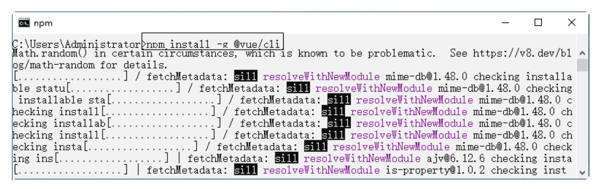
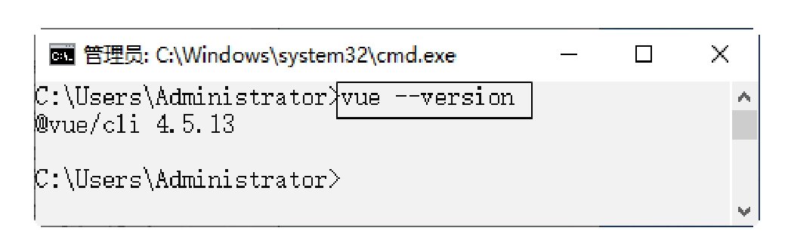
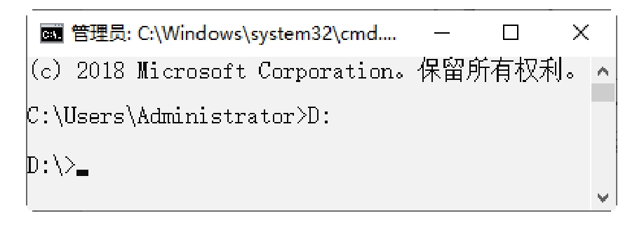
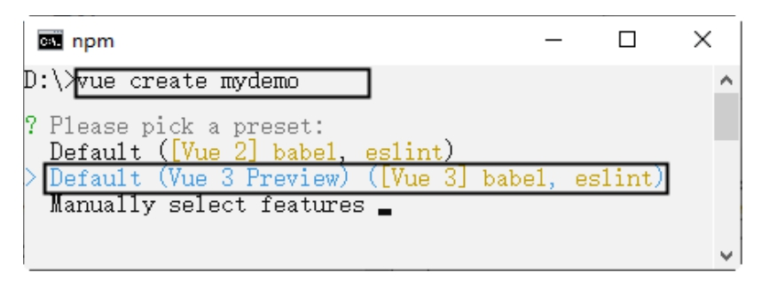
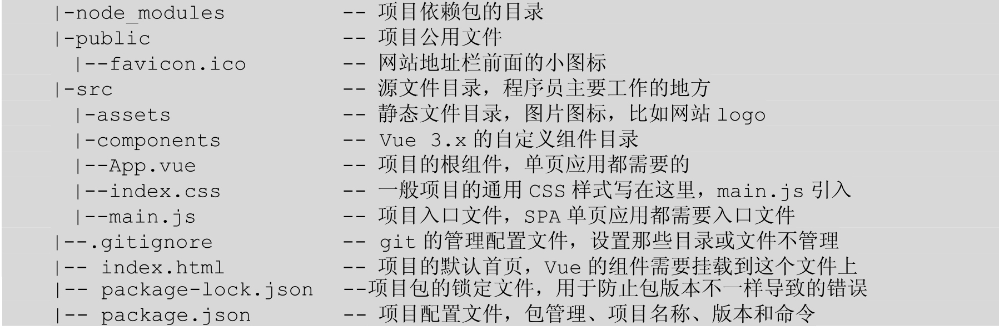

# 第13章　精通Vue CLI和Vite

开发大型单页面应用时，需要考虑项目的组织结构、项目构建、部署、热加载等问题，这些工作非常耗费时间，影响项目的开发效率。为此，本章将介绍一些能够创建脚手架的工具。脚手架致力于将Vue生态中的工具基础标准化。它确保了各种构建工具能够基于智能的默认配置即可平稳衔接，这样可以把精力放在开发应用的核心业务上，而不必花时间去纠结配置的问题。

## 13.1　脚手架的组件

Vue CLI是一个基于Vue.js进行快速开发的完整系统，提供以下功能：

（1）通过@vue/cli搭建交互式的项目脚手架。

（2）通过@vue/cli+@vue/cli-service-global快速开始零配置原型开发。

（3）一个运行时的依赖（@vue/cli-service），该依赖基于webpack构建，并带有合理的默认配置，该依赖可升级，也可以通过项目内的配置文件进行配置，还可以通过插件进行扩展。

（4）一个丰富的官方插件集合，集成了前端生态中最好的工具。

（5）一套完全图形化的创建和管理Vue.js项目的用户界面。

Vue CLI有几个独立的部分——如果了解过Vue的源代码，会发现这个仓库里同时管理了多个单独发布的包。下面我们分别讲解这些包。

1．CLI

CLI（@vue/cli）是一个全局安装的NPM包，提供了终端里使用的Vue命令。它可以通过vue create命令快速创建一个新项目的脚手架，或者直接通过vue serve命令构建新想法的原型。也可以使用vue ui命令，通过一套图形化界面管理你的所有项目。

2．CLI服务

CLI服务（@vue/cli-service）是一个开发环境依赖。它是一个NPM包，局部安装在每个@vue/cli创建的项目中。CLI服务构建于webpack和webpack-dev-server之上，它包含了以下内容：

（1）加载其他CLI插件的核心服务。

（2）一个针对绝大部分应用优化过的内部的webpack配置。

（3）项目内部的vue-cli-service命令，提供serve、build和inspect命令。

（4）熟悉create-react-app的话，@vue/cli-service实际上大致等价于react-scripts，尽管功能集合不一样。

3．CLI插件

CLI插件是向Vue项目提供可选功能的NPM包，例如Babel/TypeScript转译、ESLint集成、单元测试和end-to-end测试等。Vue CLI插件的名字以@vue/cli-plugin-（内建插件）或vue-cli-plugin-（社区插件）开头，非常容易使用。在项目内部运行vue-cli-service命令时，它会自动解析并加载package.json中列出的所有CLI插件。

插件可以作为项目创建过程的一部分，或在后期加入到项目中。它们也可以被归成一组可复用的preset。

## 13.2　脚手架环境搭建

新版本的脚手架包名称由vue-cli改成了@vue/cli。如果已经全局安装了旧版本的vue-cli（1.x或2.x），需要先通过npm uninstall vue-cli-g或yarn global remove vue-cli命令卸载它。Vue CLI需要安装Node.js 8.9或更高版本（推荐8.11.0+）。

（1）首先在浏览器中打开Node.js官网https://nodejs.org/en/，如图13-1所示，下载推荐版本。

（2）文件下载完成后，双击安装文件，进入欢迎界面，如图13-2所示。

[插图]

图13-1　Node官网

[插图]

图13-2　Node.js安装欢迎界面

（3）单击“Next”按钮，进入许可协议窗口，选择“I accept the terms in the License Agreement”复选框，如图13-3所示。

（4）单击“Next”按钮，进入设置安装路径窗口，如图13-4所示。

[插图]

图13-3　许可协议窗口

[插图]

图13-4　node.js安装欢迎界面

（5）单击“Next”按钮，进入自定义设置窗口，如图13-5所示。

（6）单击“Next”按钮，进入本机模块设置工具窗口，如图13-6所示。

[插图]

图13-5　自定义设置窗口

[插图]

图13-6　本机模块设置工具窗口

（7）单击“Next”按钮，进入准备安装窗口，如图13-7所示。

（8）单击“Install”按钮，开始安装并显示安装的进度，如图13-8所示。

[插图]

图13-7　准备安装窗口

[插图]

图13-8　显示安装的进度

（9）安装完成后，单击“Finish”按钮，完成软件的安装，如图13-9所示。

[插图]

图13-9　完成软件的安装

安装成功后，需要检测是否安装成功。具体步骤如下：

（1）打开“DOS系统”窗口。使用“Window+R”键打开运行对话框，然后在运行对话框中输入cmd，如图13-10所示。

（2）单击“确定”按钮，即可打开“DOS系统”窗口，输入命令“node-v”，然后按下回车键，如果出现Node对应的版本号，则说明安装成功，如图13-11所示。

[插图]

图13-10　运行对话框中输入cmd

[插图]

图13-11　检查node版本

> 提示：
>
> 因为Node.js已经自带NPM（包管理工具），直接在DOS系统窗口中输入命令“npm-v”来检验其版本，如图13-12所示。


[插图]

图13-12　检查npm版本

## 13.3　安装脚手架

可以使用下列其中一个命令来安装脚手架：

```sh
npm install -g @vue/cli
```

或者

```sh
yarn global add @vue/cli
```

这里使用“npm install-g@vue/cli”命令来安装。在窗口中输入命令，并按下回车键，即可进行安装，如图13-13所示。



图13-13　安装脚手架

> 提示：
>
> 除了使用npm安装之外，还可以使用淘宝镜像（cnpm）来进行安装，安装的速度更快。安装之后，可以使用“v.ue--version”命令来检查其版本是否正确（4.x），如图13-14所示。
>
> 
>
> 图13-14　检查脚手架版本

## 13.4　创建项目

上一节中脚手架的环境已经配置完成了，本节将讲解使用脚手架来快速创建项目。

### 13.4.1　使用命令

首先打开创建项目的路径，例如在（D:）磁盘创建项目，项目名称为mydemo。具体的步骤说明如下。

（1）打开“DOS系统”窗口，在窗口中输入“D:”命令，按下回车键进入到D盘，如图13-15所示。

（2）在D盘创建mydemo项目。在DOS系统窗口中输入“vue create mydemo”命令，按下回车键进行创建。紧接着会提示配置方式，包括Vue 2.x默认配置、Vue 3.0默认配置和手动配置，使用方向键选择第二个选项，如图13-16所示。



图13-15　进入项目路径



图13-16　选择配置方式

> 注意：
>
> 项目的名称不能大写，否则无法成功创建项目。

（3）这里选择Vue 3.0默认配置，直接按下回车键，即可创建mydemo项目，并显示创建的过程，如图13-17所示。


图13-17　创建mydemo项目

（4）项目创建完成后，如图13-18所示。这时可在D盘上看见创建的项目文件夹，如图13-19所示。


图13-18　项目创建完成


图13-19　创建的项目文件夹

（5）项目创建完成后，可以启动项目。紧接着上面的步骤，使用“cd mydemo”命令进入到项目，然后使用脚手架提供的“npm run serve”命令启动项目，如图13-20所示。


图13-20　启动项目

（6）项目启动成功后，会提供本地的测试域名，只需要在浏览器地址栏中输入http://localhost:8080/，即可打开项目，如图13-21所示。


图13-21　在浏览器中打开项目

> 提示：
>
> vue create命令有一些可选项，可以通过运行以下命令进行探索：
>
> ```sh
> vue create --help
> ```

vue create命令的选项如下：


### 13.4.2　使用图形化界面

我们还可以通过“vue ui”命令，以图形化界面创建和管理项目。比如，这里创建项目名称为“myapp”。具体步骤如下：

（1）打开“命令提示符”窗口，在窗口中输入“d:”命令，按回车键进入D盘根目录下。然后在窗口中输入“vue ui”命令，按回车键，如图13-22所示。


图13-22　启动图形化界面

（2）紧接着会在本地默认的浏览器上打开图形化界面，如图13-23所示。

（3）在图形化界面单击“创建”按钮，将显示创建项目的路径，如图13-24所示。


图13-23　默认浏览器打开图形化界面


图13-24　单击“创建”按钮

（4）单击“在此创建新项目”，显示创建项目的界面，输入项目的名称“myapp”，在详情选项中，根据需要进行选择，如图13-25所示。


图13-25　详情选项配置

（5）单击“下一步”按钮，将展示“预设”选项，如图13-26所示。根据需要选择一套预设即可，这里选择第二项的预设方案。


图13-26　预设选项配置

（6）单击“创建项目”按钮创建项目，如图13-27所示。


图13-27　开始创建项目

（7）项目创建完成后，D盘下即可看到myapp项目的文件夹。浏览器中将显示如图13-28所示的界面，其他四个部分：插件、依赖、配置和任务，分别如图13-29~图13-32所示。


图13-28　创建完成浏览器显示效果


图13-29　插件配置界面


图13-30　依赖配置界面


图13-31　项目配置界面


图13-32　任务界面

## 13.5　分析项目结构

打开mydemo文件夹，目录结构如图13-33所示。


图13-33　项目目录结构

项目目录下的文件夹和文件的用途说明如下：

（1）node_modules文件夹：项目依赖的模块。

（2）public文件夹：该目录下的文件不会被webpack编译压缩处理，这里会存放引用的第三方库的JS文件。

（3）src文件夹：项目的主目录。

（4）.gitignore：配置在git提交项目代码时忽略哪些文件或文件夹。

（5）babel.config.js：Babel使用的配置文件。

（6）package.json：npm的配置文件，其中设定了脚本和项目依赖的库。

（7）package-lock.json：用于锁定项目实际安装的各个npm包的具体来源和版本号。

（8）REDAME.md：项目说明文件。下面分析几个关键的文件代码。src文件夹下的App.vue文件和main.js文件、public文件夹下的index.html文件。

1．App.vue文件该文件是一个单文件组件，包含了组件代码、模板代码和CSS样式规则。这里引入了HelloWord组件，然后在template中使用它。具体代码如下：

```html

```

2．main.js文件该文件是程序入口的JavaScript文件，主要用于加载各种公共组件和项目需要用到的各种插件，并创建Vue的根实例。具体代码如下：

```html

```

3．index.html文件该文件为项目的主文件，这里包含一个id为app的div元素，组件实例会自动挂载到该元素上。具体代码如下：

```html
```

## 13.6　配置Scss、Less和Stuly

现在流行的CSS预处理器有Less、Sass和Stylus等，如果想要在Vue cli创建的项目中使用这些预处理器，可以在创建项目的时候进行配置。下面以配置scss为例进行讲解，其他预处理的设置方法类似。

（1）使用“vue create sassdemo”命令创建项目时，选择手动配置模块，如图13-34所示。

（2）按回车键，进入到模块配置界面，然后通过空格键选择要配置的模块，这里选择“CSS Pre-processors”来配置预处理器，如图13-35所示。

[插图]

图13-34　手动配置模块

[插图]

图13-35　模块配置界面

（3）按回车键，进入选择版本界面，这里选择3.x选项，如图13-36所示。

（4）按回车键，进入到CSS预处理器选择界面，这里选择Sass/SCSS(with dart-scss)，如图13-37所示。

[插图]

图13-36　选择3.x选项

[插图]

图13-37　选择Sass/SCSS(with dart-scss)

（5）按回车键，进入到代码格式和校验选项界面，这里选择默认的第一项，表示仅用于错误预防，如图13-38所示。

[插图]

图13-38　代码格式和校验选项界面

（6）按回车键，进入何时检查代码界面，这里选择默认的第一项，表示保存时检测，如图13-39所示。

[插图]

图13-39　何时检查代码界面

（7）按回车键，接下来设置如何保存配置信息，第1项表示在专门的配置文件中保存配置信息，第2项表示在package.json文件中保存配置信息，这里选择第1项，如图13-40所示。

[插图]

图13-40　设置如何保存配置信息

（8）按回车键，接下来设置是否保存本次设置，如果选择保存本次设置，以后再使用vue create命令创建项目时，会出现保存过的配置供用户选择。这里输入“y”，表示保存本次设置，如图13-41所示。

[插图]

图13-41　保存本次设置

（9）按回车键，接下来为本次配置取个名字，这里输入“myset”，如图13-42所示。

[插图]

图13-42　设置本次设置的名字

（10）按回车键，项目创建完成后，结果如图13-43所示。

[插图]

图13-43　项目创建完成项目创建完成之后，在组件的style标签中添加lang="scss"，便可以使用Scss预处理器了。在App.vue组件编写代码，定义了2个div元素，使用scss定义其样式，代码如下：

```html

```

使用“cd app”命令进入到项目，然后使用脚手架提供的“npm run serve”命令启动项目，在浏览器中运行项目，效果如图13-44所示。

[插图]

图13-44　项目运行效果

## 13.7　配置文件package.json

package.json是JSON格式的npm配置文件，定义了项目所需要的各种模块，以及项目的配置信息。在项目开发中经常需要修改该文件的配置内容。package.json的代码和注释如下：


在使用NPM安装依赖的模块时，可以根据模块是否需要在生产环境下使用而选择附加-S或者-D参数。例如以下命令：

```html
npm install element-ui -S
// 等价于
npm install element-ui -save
```

安装后会在dependencies中写入依赖性，在项目打包发布时，dependencies中写入的依赖性也会一起打包。

## 13.8　Vue 3.0新增开发构建工具——Vite

Vite是Vue的作者尤雨溪开发的Web开发构建工具，它是一个基于浏览器原生ES模块导入的开发服务器，其在开发环境下，利用浏览器解析import，在服务器端按需编译返回，完全跳过打包的这个操作，服务器随启随用。可见，Vite专注于提供一个快速的开发服务器和基本的构建工具。

不过需要特别注意的是，Vite是Vue 3.0新增开发构建工具，目前仅仅支持Vue 3.0，所以与Vue 3.0不兼容的库也不能与Vite一起使用。

Vite提供了npm和yarm命令方式创建项目。例如使用npm命令创建项目myapp，命令如下：

```html

```

执行过程如图13-45所示。[插图]图13-45　使用npm命令创建项目myapp项目启动成功后，会提供本地的测试域名，只需要在浏览器地址栏中输入http://localhost:3000/，即可打开项目，如图13-46所示。

[插图]

图13-46　在浏览器中打开项目

使用Vite生成的项目结构和含义如下：



其中配置文件package.json的代码如下：

```json
{
  "name": "myviteapp",
  "version": "0.0.0",
  "scripts": {
    "dev": "vite",
    "build": "vite build"
  },
  "dependencies": {
    "vue": "^3.0.4"
  },
  "devDependencies": {
    "vite": "^1.0.0-rc.13",
    "@vue/compiler-sfc": "^3.0.4"
  }
}

```

如果需要构建生产环境下的发布版本，则只需要在终端窗口执行以下命令：

```sh
npm run build
```

如果使用yarn命令创建项目myapp，则依次执行以下命令：

```sh
yarn create vite-app myviteapp
cd myviteapp
yarn
yarn dev
```

> 提示：
>
> 如果没有安装yarn，则执行以下命令安装yarn：
>
> ```sh
> npm install -g yarn
> ```

## 13.9　疑难解惑

疑问1：如何删除自定义的脚手架项目的配置？

如果要删除自定义的脚手架项目的配置，可以在操作系统的用户目录下找到.vuerc文件，然后找到配置信息删除即可。

疑问2：下载别人的代码如何安装依赖呢？

在发布代码时，项目下的node_modules文件夹都不会发布。那么在下载了别人的代码后，怎么安装依赖呢？这时可以在项目根路径下执行npm install命令，该命令会根据package.json文件下载所需要的依赖。


