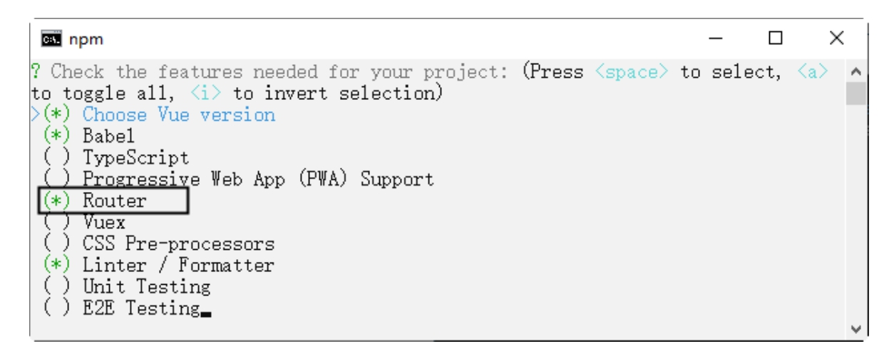
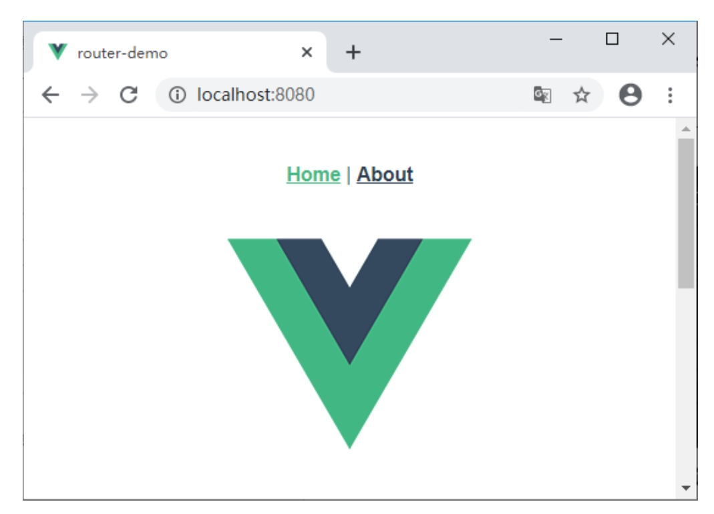
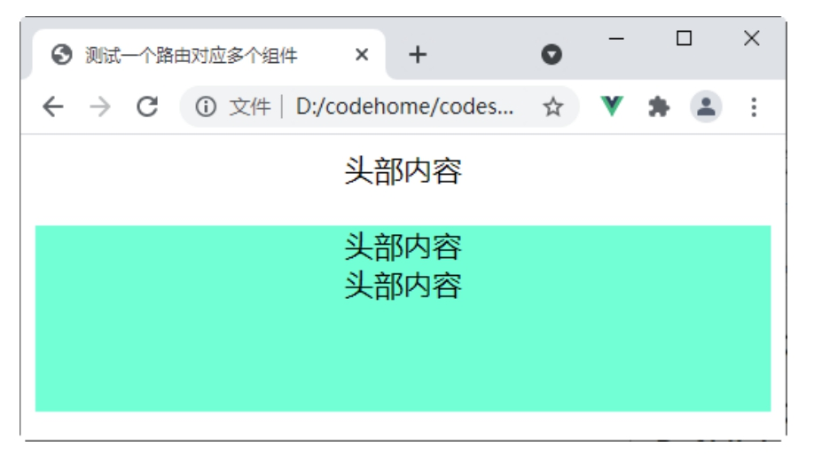
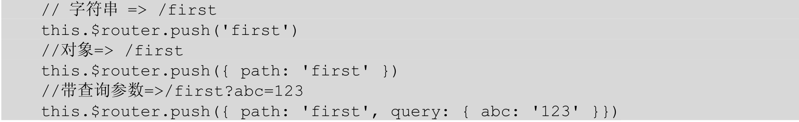
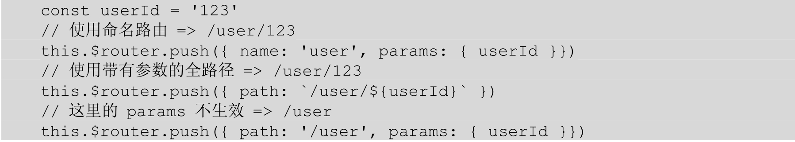
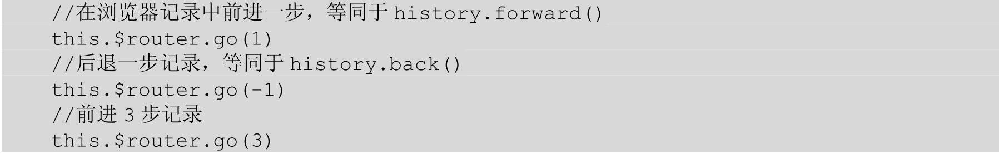
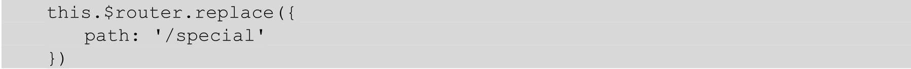

# 第14章　使用Vue Router开发单页面应用

在传统的多页面应用中，不同的页面之间的跳转都需要向服务器发起请求，服务器处理请求后向浏览器推送页面。但是在单页面应用中，整个项目中只会存在一个HTML文件，当用户切换页面时，只是通过对这个唯一的HTML文件进行动态重写，从而达到响应用户的请求。由于访问的页面是并不真实存在的，页面间的跳转都是在浏览器端完成的，这就需要用到前端路由。本章将重点学习官方的路由管理器Vue Router。

## 14.1　使用Vue Router

下面来看一下如何在HTML页面和项目中使用Vue Router。

### 14.1.1　HTML页面使用路由

在HTML页面中使用路由，有以下几个步骤。

（1）首先需要将Vue Router添加到HTML页面，这里采用可以直接引用CDN的方式添加前端路由。

```html
<!--引入vue文件-->
<script src="https://unpkg.com/vue@next"></script>
```

（2）使用router-link标签来设置导航链接：

```html
<router-link to="/home">首页</router-link>
<router-link to="/list"></router-link>
<router-link to="/about" >联系我们</router-link>
```

当然，默认生成的是a标签，如果想要将路由信息生成别的HTML标签，可以使用v-slot API完全定制<router-link>。例如生成的标签类型为按钮。

```html
<!-- 渲染成 button 标签 -->
<router-link to="/list"  custom v-slot="{navigate}">
           <button @click="navigate" @keypress.enter="navigate"> 古诗欣赏</button>
</router-link>
```

（3）指定组件在何处渲染，通过<router-view>指定：

```html
<router-view ></router-view>
```

当单击router-link标签时，会在<router-view>所在的位置渲染组件的模板内容。

（4）定义路由组件，这里定义的是一些简单的组件：

```js
const home={template:'<div>home组件的内容</div>'};
const list={template:'<div>list组件的内容</div>'};
const details={template:'<div>details组件的内容</div>'};
```

（5）定义路由，在路由中将前面定义的链接和定义的组件一一对应。

```js
const routes=[
  {path:'/home',component:home},
  {path:'/list',component:list},
  {path:'/details',component:details}
];
```

（6）创建Vue Router实例，将上一步定义的路由配置作为选项传递进来。

```js
const router= VueRouter.createRouter({
    // 提供要实现的history实现。为了方便起见，这里使用hash history
    history: VueRouter.createWebHashHistory(),
    routes//简写，相当于routes：routes
});
```

（7）在应用实例中调用use()方法，传入上一步创建的router对象，从而让整个应用程序使用路由。

```js
const vm= Vue.createApp({});
//使用路由器实例，从而让整个应用都有路由功能
vm.use(router);
vm.mount('#app');
```

到这里，路由的配置就完成了。下面演示一下在HTML页面中使用路由。

【例14.1】在HTML页面中使用路由（源代码\ch14\14.1.html）。

```html
<!DOCTYPE html>
<html>
<head>
    <meta charset="UTF-8">
    <title>在HTML页面中使用路由</title>
</head>
<body>
<style>
    #app {
        text-align: center;
    }
    .container {
        background-color: #73ffd6;
        margin-top: 20px;
        height: 100px;
    }
</style>
<div id="app">
    <router-link to="/home">首页</router-link>
    <router-link to="/list" custom v-slot="{navigate}">
        <button @click="navigate" @keypress.enter="navigate"> 古诗欣赏</button>
    </router-link>
    <router-link to="/about">联系我们</router-link>
    <div class="container">
        <router-view></router-view>
    </div>
</div>
<!--引入vue文件-->
<script src="https://unpkg.com/vue@next"></script>
<!--引入Vue Router-->
<script src="https://unpkg.com/vue-router@next"></script>
<script>
    const home = {template: '<div>主页内容</div>'};
    const list = {template: '<div>我不践斯境，岁月好已积。晨夕看山川，事事悉如昔。</p></div>'};
    const about = {template: '<div>需要技术支持请联系作者微信codehome6</div>'};
    const routes = [
        {path: '/home', component: home},
        {path: '/list', component: list},
        {path: '/about', component: about},
    ];
    const router = VueRouter.createRouter({
        //提供要实现的history实现。为了方便起见，这里使用hash history
        history: VueRouter.createWebHashHistory(),
        routes//简写，相当于routes：routes
    });
    const vm = Vue.createApp({});
    //使用路由器实例，从而让整个应用都有路由功能
    vm.use(router);
    vm.mount('#app');
</script>
</body>
</html>
```

在浏览器中运行程序，单击“古诗欣赏”链接，然后单击“古诗2”链接，效果如图14-2所示。


图14-1　在HTML页面中使用路由

Vue还可以嵌套路由，例如，在list组件中创建一个导航，导航包含古诗1和古诗2两个选项，每个选项的链接对应一个路由和组件。古诗1和古诗2两个选项分别对应poetry1和poetry2组件。

因此，在构建URL时，应该将该地址位于/list URL后面，从而更好地表达这种关系。所以，在list组件中又添加了一个router-view标签，用来渲染出嵌套的组件内容。同时，通过在定义routes时，在参数中使用children属性，从而达到配置嵌套路由信息的目的。嵌套路由示例如下。

【例14.2】嵌套路由（源代码\ch14\14.2.html）。

```html
<!DOCTYPE html>
<html>
<head>
    <meta charset="UTF-8">
    <title>嵌套路由</title>
    <style>
        #app {
            text-align: center;
        }

        .container {
            background-color: #73ffd6;
            margin-top: 20px;
            height: 100px;
        }
    </style>
</head>
<body>
<div id="app">
    <!-- 通过 router-link 标签来生成导航链接 -->
    <router-link to="/home">首页</router-link>
    <router-link to="/list" custom v-slot="{navigate}">
        <button @click="navigate" @keypress.enter="navigate"> 古诗欣赏</button>
    </router-link>
    <router-link to="/about">关于我们</router-link>
    <div class="container">
        <!-- 将选中的路由渲染到 router-view 下-->
        <router-view></router-view>
    </div>
</div>
<template id="tmpl">
    <div>
        <h3>列表内容</h3>
        <!-- 生成嵌套子路由地址 -->
        <router-link to="/list/poetry1">古诗1</router-link>
        <router-link to="/list/poetry2">古诗2</router-link>
        <div class="sty">
            <!-- 生成嵌套子路由渲染节点 -->
            <router-view></router-view>
        </div>
    </div>
</template>
<!--引入vue文件-->
<script src="https://unpkg.com/vue@next"></script>
<!--引入Vue Router-->
<script src="https://unpkg.com/vue-router@next"></script>
<script>
    const home = {template: '<div>主页内容</div>'};
    const list = {template: '#tmpl'};
    const about = {template: '<div>需要技术支持请联系作者微信codehome6</div>'};
    const poetry1 = {
        template: '<div> 红颜弃轩冕，白首卧松云。</div>'
    };
    const poetry2 = {
        template: '<div>为问门前客，今朝几个来。</div>'
    };
    // 2.定义路由信息
    const routes = [
        // 路由重定向：当路径为/时，重定向到/list路径
        {
            path: '/',
            redirect: '/list'
        },
        {
            path: '/home',
            component: home,
        },
        {
            path: '/list',
            component: list,
            //嵌套路由
            children: [
                {
                    path: 'poetry1',
                    component: poetry1
                },
                {
                    path: 'poetry2',
                    component: poetry2
                },
            ]
        },
        {
            path: '/about',
            component: about,
        }
    ];
    const router = VueRouter.createRouter({
        //提供要实现的history实现。为了方便起见，这里使用hash history
        history: VueRouter.createWebHashHistory(),
        routes  //简写，相当于routes：routes
    });
    const vm = Vue.createApp({});
    //使用路由器实例，从而让整个应用都有路由功能
    vm.use(router);
    vm.mount('#app');
</script>
</body>
</html>
```

在浏览器中运行程序，单击“古诗欣赏”链接，然后单击“古诗2”链接，效果如图14-2所示。


图14-2　路由实现

### 14.1.2　项目中使用路由

在Vue脚手架创建的项目中使用路由，可以在创建项目时选择配置路由。例如，使用vue create router-demo创建项目，在配置选项时，选择手动配置，然后配置Router，如图14-3所示。



图14-3　配置路由Router

项目创建完成之后运行项目，然后在浏览器中打开项目，可以发现页面顶部有Home和About两个可切换的选项，如图14-4所示。



图14-4　项目运行效果

这是脚手架默认创建的例子。在创建项目的时候配置路由之后，在使用的时候就不需要再进行配置了。具体实现和上面示例基本一样。在项目view目录下可以看到Home和About两个组件，在根组件中创建导航，有Home和About两个选项，使用<router-link>来设置导航链接，通过<router-view>指定Home和About组件在根组件App中渲染，App组件代码如下：

```vue
<template>
  <nav>
    <router-link to="/">Home</router-link> |
    <router-link to="/about">About</router-link>
  </nav>
  <router-view/>
</template>
```

然后在项目router目录的index.js文件夹下配置路由信息。index.js在main.js文件中进行了注册，所以在项目中直接可以使用路由。在index.js文件中通过路由，把Home和About组件和对应的导航链接对应起来，路由在routes数组中进行配置，代码如下：

```js
const routes = [
  {
    path: '/',
    name: 'home',
    component: HomeView
  },
  {
    path: '/about',
    name: 'about',
    // route level code-splitting
    // this generates a separate chunk (about.[hash].js) for this route
    // which is lazy-loaded when the route is visited.
    component: () => import(/* webpackChunkName: "about" */ '../views/AboutView.vue')
  }
]
```

在项目中就可以这样来使用路由。

## 14.2　命名路由

在某些时候，生成的路由URL地址可能会很长，在使用中可能会显得有些不便。这时候通过一个名称来标识一个路由更方便一些。因此在Vue Router中，可以在创建Router实例的时候，通过在routes配置中给某个路由设置名称，从而方便的调用路由。

```js
const routes = [
  {
    path: '/',
    name: 'home',
    component: '<div>form组件</div>'
  }
]
```

使用了命名路由之后，在需要使用router-link标签进行跳转时，可以采取给router-link的to属性传一个对象的方式，跳转到指定的路由地址上，例如：

```html
<router-link :to="{name:'router1'}">名称</router-link>
```

【例14.3】命名路由（源代码\ch14\14.3.html）。

```html
<!DOCTYPE html>
<html>
<head>
    <meta charset="UTF-8">
    <title>命名路由</title>
</head>
<body>
<style>
    #app {
        text-align: center;
    }

    .container {
        background-color: #73ffd6;
        margin-top: 20px;
        height: 100px;
    }
</style>
<div id="app">
    <router-link :to="{name:'router1'}">首页</router-link>
    <router-link to="/list" custom v-slot="{navigate}">
        <button @click="navigate" @keypress.enter="navigate"> 古诗欣赏</button>
    </router-link>

    <router-link :to="{name:'router3'}">联系我们</router-link>
    <!—路由匹配到的组件将在这里渲染 -->
    <div class="container">
        <router-view></router-view>
    </div>
</div>
<!--引入vue文件-->
<script src="https://unpkg.com/vue@next"></script>
<!--引入Vue Router-->
<script src="https://unpkg.com/vue-router@next"></script>
<script>
    //定义路由组件
    const home = {template: '<div>home组件的内容</div>'};
    const list = {template: '<div>红颜弃轩冕，白首卧松云。</div>'};
    const details = {template: '<div>需要技术支持请联系作者微信codehome6</div>'};
    const routes = [
        {path: '/home', component: home, name: 'router1',},
        {path: '/list', component: list, name: 'router2',},
        {path: '/details', component: details, name: 'router3',},
    ];
    const router = VueRouter.createRouter({
        //提供要实现的history实现。为了方便起见，这里使用hash history
        history: VueRouter.createWebHashHistory(),
        routes//简写，相当于routes：routes
    });
    const vm = Vue.createApp({});
    //使用路由器实例，从而让整个应用都有路由功能
    vm.use(router);
    vm.mount('#app');
</script>
</body>
</html>
```

在浏览器中运行程序，效果如图14-5所示。


图14-5　命名路由还可以使用params属性设置参数，例如：

```html
<router-link :to="{name:'user', params: {userId: 123}}">User</router-link>
```

这跟代码调用router.push()是一样的：

```js
router.push({name:'user', params: {userId: 123}})
```

这两种方式都会把路由导航到/user/123路径。

## 14.3　命名视图

当打开一个页面时，整个页面可能是由多个Vue组件所构成的。例如，后台管理首页可能是由sidebar（侧导航）、header（顶部导航）和main（主内容）这三个Vue组件构成的。此时，通过Vue Router构建路由信息时，如果一个URL只能对应一个Vue组件，则整个页面是无法正确显示的。

在上一节构建路由信息的时候，使用到两个特殊的标签：router-view和router-link。通过router-view标签，可以指定组件渲染显示到什么位置。当需要在一个页面上显示多个组件的时候，就需要在页面中添加多个的router-view标签。

那么，是不是可以通过一个路由对应多个组件，然后按需渲染在不同的router-view标签上呢？按照上一节关于Vue Router的使用方法，可以很容易地实现下面的示例代码。

【例14.4】测试一个路由对应多个组件（源代码\ch14\14.4.html）。

```html
<!DOCTYPE html>
<html>
<head>
    <meta charset="UTF-8">
    <title>测试一个路由对应多个组件</title>
</head>
<body>
<style>
    #app {
        text-align: center;
    }

    .container {
        background-color: #73ffd6;
        margin-top: 20px;
        height: 100px;
    }
</style>
<div id="app">
    <router-view></router-view>
    <div class="container">
        <router-view></router-view>
        <router-view></router-view>
    </div>
</div>
<template id="sidebar">
    <div class="sidebar">
        侧边栏内容
    </div>
</template>
<!--引入vue文件-->
<script src="https://unpkg.com/vue@next"></script>
<!--引入Vue Router-->
<script src="https://unpkg.com/vue-router@next"></script>
<script>
    // 1.定义路由跳转的组件模板
    const header = {
        template: '<div class="header"> 头部内容 </div>'
    }
    const sidebar = {
        template: '#sidebar',
    }
    const main = {
        template: '<div class="main">主要内容</div>'
    }
    // 2.定义路由信息
    const routes = [{
        path: '/',
        component: header
    }, {
        path: '/',
        component: sidebar
    }, {
        path: '/',
        component: main
    }];
    const router = VueRouter.createRouter({
        //提供要实现的history实现。为了方便起见，这里使用hash history
        history: VueRouter.createWebHashHistory(),
        routes   //简写，相当于routes：routes
    });
    const vm = Vue.createApp({});
    //使用路由器实例，从而让整个应用都有路由功能
    vm.use(router);
    vm.mount('#app');
</script>
</body>
</html>
```

在浏览器中运行程序，效果如图14-6所示。



图14-6　一个路由对应多个组件

可以看到，并没有实现想要按需渲染组件的效果。当一个路由信息对应到多个组件时，不管有多少个router-view标签，程序都会将第一个组件渲染到所有的router-view标签上。

在Vue Router中，可以通过命名视图的方式，实现一个路由信息按照需要去渲染到页面中指定的router-view标签。

命名视图与命名路由的实现方式相似，命名视图通过在router-view标签上设定name属性，之后在构建路由与组件的对应关系时，以一种name:component的形式构造出一个组件对象，从而指明是在哪个router-view标签上加载什么组件。

> 注意：
>
> 在指定路由对应的组件时，使用的是components（包含s）属性进行配置组件。

实现命名视图的代码如下所示：

```html
<div id="app">
    <div class="container">
        <router-view name="sidebar"></router-view>
        <router-view name="main"></router-view>
    </div>
</div>
<script>
    // 2.定义路由信息
    const routes = [{
        path: '/',
        components: {
            default: header,
            sidebar: sidebar,
            main: main
        }
    }];
</script>
```

在router-view中，name属性值默认为default，所以这里的header组件对应的router-view标签就可以不设定name属性值。完整示例如下所示。

【例14.5】命名视图（源代码\ch14\14.5.html）。

```html
<!DOCTYPE html>
<html>
<head>
    <meta charset="UTF-8">
    <title>命名路由</title>
</head>
<body>
<style>
    .style1 {
        height: 20vh;
        background: #0BB20C;
        color: white;
    }

    .style2 {
        background: #9e8158;
        float: left;
        width: 30%;
        height: 70vh;
        color: white;
    }

    .style3 {
        background: #2d309e;
        float: left;
        width: 70%;
        height: 70vh;
        color: white;
    }
</style>
<div id="app">
    <div class="style1">
        <router-view></router-view>
    </div>
    <div class="container">
        <div class="style2">
            <router-view name="sidebar"></router-view>
        </div>
        <div class="style3">
            <router-view name="main"></router-view>
        </div>
    </div>
</div>
<template id="sidebar">
    <div class="sidebar">
        侧边栏导航内容
    </div>
</template>
<!--引入vue文件-->
<script src="https://unpkg.com/vue@next"></script>
<!--引入Vue Router-->
<script src="https://unpkg.com/vue-router@next"></script>
<script>
    // 1.定义路由跳转的组件模板
    const header = {
        template: '<div class="header"> 头部内容 </div>'
    }
    const sidebar = {
        template: '#sidebar'
    }
    const main = {
        template: '<div class="main">正文部分</div>'
    }
    // 2.定义路由信息
    const routes = [{
        path: '/',
        components: {
            default: header,
            sidebar: sidebar,
            main: main
        }
    }];
    const router = VueRouter.createRouter({
        //提供要实现的history实现。为了方便起见，这里使用hash history
        history: VueRouter.createWebHashHistory(),
        routes   //简写，相当于routes：routes
    });
    const vm = Vue.createApp({});
    //使用路由器实例，从而让整个应用都有路由功能
    vm.use(router);
    vm.mount('#app');
</script>
</body>
</html>
```

在浏览器中运行程序，效果如图14-7所示。


图14-7　命名视图

## 14.4　路由传参

在很多的情况下，例如表单提交，组件跳转之类的操作，需要使用到上一个表单、组件的一些数据，这时可以将需要的参数通过传参的方式在路由间进行传递。本节介绍传参方式：param传参。

param传参就是将需要的参数以key=value的方式放在URL地址中。在定义路由信息时，需要以占位符（:参数名）的方式将需要传递的参数指定到路由地址中，示例代码如下：

```js
const routes = [{
    path: '/',
    components: {
        default: header,
        sidebar: sidebar,
        main: main
    },
    children: [{
        path: '',
        redirect: 'form'
    }, {
        path: 'form',
        name: 'form',
        component: form
    }, {
        path: 'info/:email/:password',
        name: 'info',
        component: info
    }]
}];
```

因为在使用$route.push进行路由跳转时，如果提供了path属性，则对象中的params属性会被忽略，所以这里可以采用命名路由的方式进行跳转，或者直接将参数值传递到路由path路径中。这里的参数如果不进行赋值的话，就无法与匹配规则对应，也就无法跳转到指定的路由地址中。param传参的示例如下。

【例14.6】param传参（源代码\ch14\14.6.html）。

```html
<!DOCTYPE html>
<html>
<head>
    <meta charset="UTF-8">
    <title>param传参</title>
</head>
<body>
<style>
    .style1 {
        background: #0BB20C;
        color: white;
        padding: 15px;
        margin: 15px 0;
    }

    .main {
        padding: 10px;
    }
</style>
<body>
<div id="app">
    <div>
        <div class="style1">
            <router-view></router-view>
        </div>
    </div>
    <div class="main">
        <router-view name="main"></router-view>
    </div>
</div>
<template id="sidebar">
    <div>
        <ul>
            <router-link v-for="(item,index) in menu" :key="index" :to="item.url" tag="li">{{ item.name }}
            </router-link>
        </ul>
    </div>
</template>

<template id="main">
    <div>
        <router-view></router-view>
    </div>
</template>
<template id="form">
    <div>
        <form>
            <div>
                <label for="exampleInputEmail1">邮箱</label>
                <input type="email" id="exampleInputEmail1" placeholder="输入电子邮件" v-model="email">
            </div>
            <div>
                <label for="exampleInputPassword1">密码</label>
                <input type="password" id="exampleInputPassword1" placeholder="输入密码" v-model="password">
            </div>
            <button type="submit" @click="submit">提交</button>
        </form>
    </div>
</template>
<template id="info">
    <div>
        <div>
            输入的信息
        </div>
        <div>
            <blockquote>
                <p>邮箱：{{ $route.params.email }} </p>
                <p>密码：{{ $route.params.password }}</p>
            </blockquote>
        </div>
    </div>
</template>
<!--引入vue文件-->
<script src="https://unpkg.com/vue@next"></script>
<!--引入Vue Router-->
<script src="https://unpkg.com/vue-router@next"></script>
<script>
    // 1.定义路由跳转的组件模板
    const header = {
        template: '<div class="header">头部</div>'
    }
    const sidebar = {
        template: '#sidebar',
        data: function () {
            return {
                menu: [{
                    displayName: 'Form',
                    routeName: 'form'
                }, {
                    displayName: 'Info',
                    routeName: 'info'
                }]
            }
        },
    }
    const main = {
        template: '#main'
    }
    const form = {
        template: '#form',
        data: function () {
            return {
                email: '',
                password: ''
            }
        },
        methods: {
            submit: function () {
                // 方式1
                this.$router.push({
                    name: 'info',
                    params: {
                        email: this.email,
                        password: this.password
                    }
                })
            }
        },
    }
    const info = {
        template: '#info'
    }
    // 2.定义路由信息
    const routes = [{
        path: '/',
        components: {
            default: header,
            sidebar: sidebar,
            main: main
        },
        children: [{
            path: '',
            redirect: 'form'
        }, {
            path: 'form',
            name: 'form',
            component: form
        }, {
            path: 'info/:email/:password',
            name: 'info',
            component: info
        }]
    }];
    const router = VueRouter.createRouter({
        //提供要实现的history实现。为了方便起见，这里使用hash history
        history: VueRouter.createWebHashHistory(),
        routes   //简写，相当于routes：routes
    });
    const vm = Vue.createApp({
        data() {
            return {}
        },
        methods: {},
    });
    //使用路由器实例，从而让整个应用都有路由功能
    vm.use(router);
    vm.mount('#app');
</script>
</body>
</html>
```

在浏览器中运行程序，在邮箱中输入“357975357@qq.com”，在密码中输入“123456”，如图14-8所示；之后单击提交，内容传递到info子组件中进行显示，效果如图14-9所示。


图14-8　输入邮箱和密码


图14-9　param传参

## 14.5　编程式导航

在使用Vue Router时，经常会通过router-link标签去生成跳转到指定路由的链接，但是在实际的前端开发中，更多的是通过JavaScript的方式进行跳转。例如很常见的一个交互需求——用户提交表单，提交成功后跳转到上一页面，提交失败则留在当前页面。这时候如果还是通过router-link标签进行跳转就不合适了，需要通过JavaScript根据表单返回的状态进行动态的判断。

在使用Vue Router时，已经将Vue Router的实例挂载到了Vue实例上，可以借助$router的实例方法，通过编写JavaScript代码的方式实现路由间的跳转，而这种方式就是一种编程式的路由导航。

在Vue Router中具有三种导航方法，分别为push、replace和go。最常见的通过在页面上设置router-link标签进行路由地址间的跳转，就等同于执行了一次push方法。

1．push方法

当需要跳转新页面时，可以通过push方法将一条新的路由记录添加到浏览器的history栈中，通过history的自身特性，从而驱使浏览器进行页面的跳转。同时，因为在history会话历史中会一直保留着这个路由信息，所以后退时还是可以退回到当前的页面。

在push方法中，参数可以是一个字符串路径，或者是一个描述地址的对象，这里其实就等同于调用了history.pushState方法。



> 注意：
>
> 当传递的参数为一个对象并且当path与params共同使用时，对象中的params属性不会起任何的作用，需要采用命名路由的方式进行跳转，或者是直接使用带有参数的全路径。



2．go方法

当使用go方法时，可以在history记录中向前或者后退多少步，也就是说，通过go方法可以在已经存储的history路由历史中来回跳转。



3．replace方法replace方法同样可以达到实现路由跳转的目的，从名称中可以看出，与使用push方法跳转不同是，在使用replace方法时，并不会往history栈中新增一条新的记录，而是会替换掉当前的记录，因此无法通过后退按钮再回到被替换前的页面。



下面示例将通过编程式路由实现路由间的切换。

【例14.7】实现路由间的切换（源代码\ch14\14.7.html）。

```html
<!DOCTYPE html>
<html>
<head>
    <meta charset="UTF-8">
    <title>实现路由间的切换</title>
</head>
<body>
<style>
    .style1 {
        background: #0BB20C;
        color: white;
        height: 100px;
    }
</style>
<body>
<div id="app">
    <div class="main">
        <div>
            <button @click="next">前进</button>
            <button @click="goFirst">第1页</button>
            <button @click="goSecond">第2页</button>
            <button @click="goThird">第3页</button>
            <button @click="goFourth">第4页</button>
            <button @click="pre">后退</button>
            <button @click="replace">替换当前页为特殊页</button>
        </div>
        <div class="style1">
            <router-view></router-view>
        </div>
    </div>
</div>
<!--引入vue文件-->
<script src="https://unpkg.com/vue@next"></script>
<!--引入Vue Router-->
<script src="https://unpkg.com/vue-router@next"></script>
<script>
    const first = {
        template: '<h3>花时同醉破春愁，醉折花枝作酒筹。</h3>'
    };
    ;
    const second = {
        template: '<h3>忽忆故人天际去，计程今日到梁州。</h3>'
    };
    const third = {
        template: '<h3>圭峰霁色新，送此草堂人。</h3>'
    };
    const fourth = {
        template: '<h3>终有烟霞约，天台作近邻。</h3>'
    };
    const special = {
        template: '<h3>特殊页面的内容</h3>'
    };

    // 2.定义路由信息
    const routes = [
        {
            path: '/first',
            component: first
        },
        {
            path: '/second',
            component: second
        },
        {
            path: '/third',
            component: third
        },
        {
            path: '/fourth',
            component: fourth
        },
        {
            path: '/special',
            component: special
        }
    ];
    const router = VueRouter.createRouter({
        //提供要实现的history实现。为了方便起见，这里使用hash history
        history: VueRouter.createWebHashHistory(),
        routes   //简写，相当于routes：routes
    });
    const vm = Vue.createApp({
        data() {
            return {}
        },
        methods: {
            goFirst: function () {
                this.$router.push({
                    path: '/first'
                })
            },
            goSecond: function () {
                this.$router.push({
                    path: '/second'
                })
            },
            goThird: function () {
                this.$router.push({
                    path: '/third'
                })
            },
            goFourth: function () {
                this.$router.push({
                    path: '/fourth'
                })
            },
            next: function () {
                this.$router.go(1)
            },
            pre: function () {
                this.$router.go(-1)
            },
            replace: function () {
                this.$router.replace({
                    path: '/special'
                })
            }
        },
        router: router
    });
    //使用路由器实例，从而让整个应用都有路由功能
    vm.use(router);
    vm.mount('#app');
</script>
</body>
</html>
```

在浏览器中运行程序，单击“第4页”按钮，效果如图14-10所示。


图14-10　实现路由间的切换

## 14.6　组件与Vue Router间解耦

在使用路由传参的时候，将组件与Vue Router强绑定在一起，这意味着在任何需要获取路由参数的地方，都需要加载Vue Router，使组件只能在某些特定的URL上使用，限制了其灵活性。如何解决强绑定呢？

在之前学习组件相关知识的时候，我们提到过可以通过组件的props选项来实现子组件接收父组件传递的值。而在Vue Router中，同样提供了通过使用组件的props选项来进行解耦的功能。

### 14.6.1　布尔模式

在【例14.8】中，当定义路由模板时，通过指定需要传递的参数为props选项中的一个数据项，通过在定义路由规则时指定props属性为true，即可实现对于组件以及Vue Router之间的解耦。

【例14.8】布尔模式（源代码\ch14\14.8.html）。

```html
<!DOCTYPE html>
<html>
<head>
    <meta charset="UTF-8">
    <title>布尔模式</title>
</head>
<body>
<style>
    .style1 {
        background: #0BB20C;
        color: white;
    }
</style>
<body>
<div id="app">
    <div class="main">
        <div>
            <button @click="next">前进</button>
            <button @click="goFirst">第1页</button>
            <button @click="goSecond">第2页</button>
            <button @click="goThird">第3页</button>
            <button @click="goFourth">第4页</button>
            <button @click="pre">后退</button>
            <button @click="replace">替换当前页为特殊页</button>
        </div>
        <div class="style1">
            <router-view></router-view>
        </div>
    </div>
</div>
<!--引入vue文件-->
<script src="https://unpkg.com/vue@next"></script>
<!--引入Vue Router-->
<script src="https://unpkg.com/vue-router@next"></script>
<script>
    const first = {
        template: '<h3>花时同醉破春愁，醉折花枝作酒筹。</h3>'
    };
    const second = {
        template: '<h3>忽忆故人天际去，计程今日到梁州。</h3>'
    };
    const third = {
        props: ['id'],
        template: '<h3>圭峰霁色新，送此草堂人。---{{id}}</h3>'
    };
    const fourth = {
        template: '<h3>终有烟霞约，天台作近邻。</h3>'
    };
    const special = {
        template: '<h3>特殊页面的内容</h3>'
    };
    // 2.定义路由信息
    const routes = [
        {
            path: '/first',
            component: first
        },
        {
            path: '/second',
            component: second
        },
        {
            path: '/third/:id',
            component: third,
            props: true
        },
        {
            path: '/fourth',
            component: fourth
        },
        {
            path: '/special',
            component: special
        }
    ];
    const router = VueRouter.createRouter({
        //提供要实现的history实现。为了方便起见，这里使用hash history
        history: VueRouter.createWebHashHistory(),
        routes   //简写，相当于routes：routes
    });
    const vm = Vue.createApp({
        data() {
            return {}
        },
        methods: {
            goFirst: function () {
                this.$router.push({
                    path: '/first'
                })
            },
            goSecond: function () {
                this.$router.push({
                    path: '/second'
                })
            },
            goThird: function () {
                this.$router.push({
                    path: '/third'
                })
            },
            goFourth: function () {
                this.$router.push({
                    path: '/fourth'
                })
            },
            next: function () {
                this.$router.go(1)
            },
            pre: function () {
                this.$router.go(-1)
            },
            replace: function () {
                this.$router.replace({
                    path: '/special'
                })
            }
        },
        router: router
    });
    //使用路由器实例，从而让整个应用都有路由功能
    vm.use(router);
    vm.mount('#app');
</script>
</body>
</html>
```

在浏览器中运行程序，选择第3页，然后在URL路径中添加“/abc”，再按回车键，效果如图14-11所示。


图14-11　布尔模式

> 提示：
>
> 上面示例采用param传参的方式进行参数传递，而在组件中并没有加载Vue Router实例，也完成了对于路由参数的获取。采用此方法，只能实现基于param方式进行传参的解耦。

### 14.6.2　对象模式

针对定义路由规则时，指定props属性为true这一种情况，在Vue Router中，还可以把路由规则的props属性定义成一个对象或是函数。如果定义成对象或是函数，此时并不能实现对于组件以及Vue Router间的解耦。

将路由规则的props定义成对象后，此时不管路由参数中传递的是任何值，最终获取到的都是对象中的值。需要注意的是，props中的属性值必须是静态的，不能采用类似于子组件同步获取父组件传递的值作为props中的属性值。对象模式示例如下。

【例14.9】对象模式（源代码\ch14\14.9.html）。

```html
<!DOCTYPE html>
<html>
<head>
    <meta charset="UTF-8">
    <title>对象模式</title>
</head>
<body>
<style>
    .style1 {
        background: #0BB20C;
        color: white;
    }
</style>
<body>
<div id="app">
    <div class="main">
        <div>
            <button @click="next">前进</button>
            <button @click="goFirst">第1页</button>
            <button @click="goSecond">第2页</button>
            <button @click="goThird">第3页</button>
            <button @click="goFourth">第4页</button>
            <button @click="pre">后退</button>
            <button @click="replace">替换当前页为特殊页</button>
        </div>
        <div class="style1">
            <router-view></router-view>
        </div>
    </div>
</div>
<!--引入vue文件-->
<script src="https://unpkg.com/vue@next"></script>
<!--引入Vue Router-->
<script src="https://unpkg.com/vue-router@next"></script>
<script>
    const first = {
        template: '<h3>花时同醉破春愁，醉折花枝作酒筹。</h3>'
    };
    const second = {
        template: '<h3>忽忆故人天际去，计程今日到梁州。</h3>'
    };
    const third = {
        props: ['name'],
        template: '<h3>圭峰霁色新，送此草堂人。---{{name}}</h3>'
    };
    const fourth = {
        template: '<h3>终有烟霞约，天台作近邻。</h3>'
    };
    const special = {
        template: '<h3>特殊页面的内容</h3>'
    };
    // 2.定义路由信息
    const routes = [
        {
            path: '/first',
            component: first
        },
        {
            path: '/second',
            component: second
        },
        {
            path: '/third/:name',
            component: third,
            props: {
                name: 'gushi'
            },
        },
        {
            path: '/fourth',
            component: fourth
        },
        {
            path: '/special',
            component: special
        }
    ];
    const router = VueRouter.createRouter({
        //提供要实现的history实现。为了方便起见，这里使用hash history
        history: VueRouter.createWebHashHistory(),
        routes   //简写，相当于routes：routes
    });
    const vm = Vue.createApp({
        data() {
            return {}
        },
        methods: {
            goFirst: function () {
                this.$router.push({
                    path: '/first'
                })
            },
            goSecond: function () {
                this.$router.push({
                    path: '/second'
                })
            },
            goThird: function () {
                this.$router.push({
                    path: '/third'
                })
            },
            goFourth: function () {
                this.$router.push({
                    path: '/fourth'
                })
            },
            next: function () {
                this.$router.go(1)
            },
            pre: function () {
                this.$router.go(-1)
            },
            replace: function () {
                this.$router.replace({
                    path: '/special'
                })
            }
        },
        router: router
    });
    //使用路由器实例，从而让整个应用都有路由功能
    vm.use(router);
    vm.mount('#app');
</script>
</body>
</html>
```

在浏览器中运行程序，选择第3页，然后在URL路径中添加“/gushi”，再按回车键，效果如图14-12所示。


图14-12　对象模式

## 14.6.3　函数模式

在对象模式中，只能接收静态的props属性值，而当使用了函数模式之后，就可以对静态值做数据的进一步加工，或者是与路由传参的值进行结合。函数模式示例如下。

【例14.10】函数模式（源代码\ch14\14.10.html）。

```html
<!DOCTYPE html>
<html>
<head>
    <meta charset="UTF-8">
    <title>函数模式</title>
</head>
<body>
<style>
    .style1 {
        background: #0BB20C;
        color: white;
    }
</style>
<body>
<div id="app">
    <div class="main">
        <div>
            <button @click="next">前进</button>
            <button @click="goFirst">第1页</button>
            <button @click="goSecond">第2页</button>
            <button @click="goThird">第3页</button>
            <button @click="goFourth">第4页</button>
            <button @click="pre">后退</button>
            <button @click="replace">替换当前页为特殊页</button>
        </div>
        <div class="style1">
            <router-view></router-view>
        </div>
    </div>
</div>
<!--引入vue文件-->
<script src="https://unpkg.com/vue@next"></script>
<!--引入Vue Router-->
<script src="https://unpkg.com/vue-router@next"></script>
<script>
    const first = {
        template: '<h3>花时同醉破春愁，醉折花枝作酒筹。</h3>'
    };
    const second = {
        template: '<h3>忽忆故人天际去，计程今日到梁州。</h3>'
    };
    const third = {
        props: ['name', "id"],
        template: '<h3>圭峰霁色新，送此草堂人。---{{name}}——{{id}}</h3>'
    };
    const fourth = {
        template: '<h3>终有烟霞约，天台作近邻。</h3>'
    };
    const special = {
        template: '<h3>特殊页面的内容</h3>'
    };
    // 2.定义路由信息
    const routes = [
        {
            path: '/first',
            component: first
        },
        {
            path: '/second',
            component: second
        },
        {
            path: '/third',
            component: third,
            props: (route) => ({
                id: route.query.id,
                name: "xiaohong"
            })
        },
        {
            path: '/fourth',
            component: fourth
        },
        {
            path: '/special',
            component: special
        }
    ];
    const router = VueRouter.createRouter({
        //提供要实现的history实现。为了方便起见，这里使用hash history
        history: VueRouter.createWebHashHistory(),
        routes   //简写，相当于routes：routes
    });
    const vm = Vue.createApp({
        data() {
            return {}
        },
        methods: {
            goFirst: function () {
                this.$router.push({
                    path: '/first'
                })
            },
            goSecond: function () {
                this.$router.push({
                    path: '/second'
                })
            },
            goThird: function () {
                this.$router.push({
                    path: '/third'
                })
            },
            goFourth: function () {
                this.$router.push({
                    path: '/fourth'
                })
            },
            next: function () {
                this.$router.go(1)
            },
            pre: function () {
                this.$router.go(-1)
            },
            replace: function () {
                this.$router.replace({
                    path: '/special'
                })
            }
        },
        router: router
    });
    //使用路由器实例，从而让整个应用都有路由功能
    vm.use(router);
    vm.mount('#app');
</script>
</body>
</html>
```

在浏览器中运行程序，选择第3页，然后在URL路径中输入“?id=123456”，再按回车键，效果如图14-13所示。


图14-13　函数模式

## 14.7　疑难解惑

疑问1：使用history模式的问题是什么？

在history模式下，如果是通过导航链接来路由页面，Vue Router会在内部截获单击事件，通过JavaScript操作window.history来改变浏览器地址栏里的路径，当URL匹配不到任何资源时，并不会发起HTTP请求，也不会出现404错误。为了解决这个问题，可以在前端程序部署的Web服务器上配置一个覆盖所有情况的备选，当URL匹配不到任何资源时，返回一个固定的index.html页面，这个页面就是单页应用程序的主页面。

疑问2：开发程序时选择history模式还是hash模式？

在开发应用程序中，可以先使用hash模式，在生产环境中，再根据部署的服务器调整为history模式。不过，在基于Vue脚手架项目的开发中，内置的Node服务器本身也支持history模式，所以开发时一般不会出问题。


