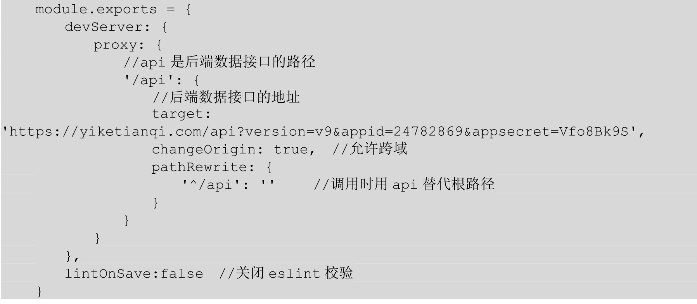
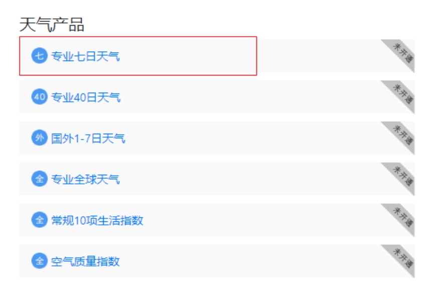
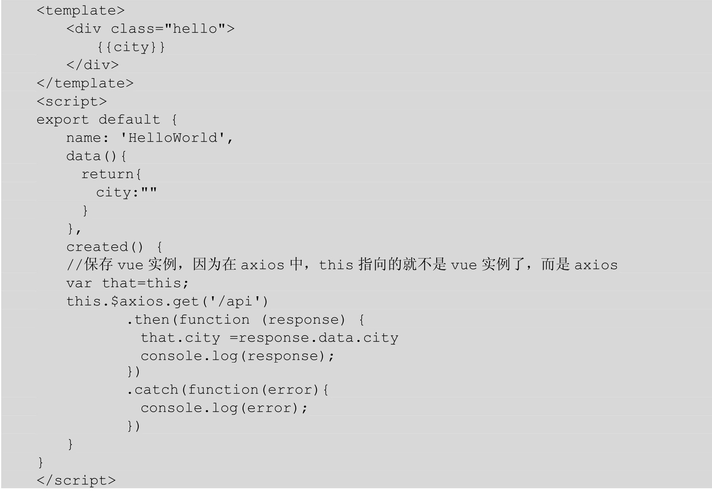
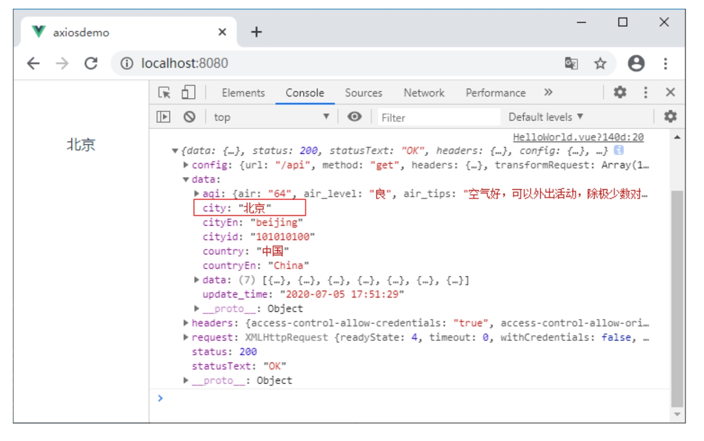

# 第15章　数据请求库——axios

在实际项目开发中，前端页面所需要的数据往往需要从服务器端获取，这必然涉及与服务器的通信，Vue推荐使用axios来完成Ajax请求。本章将学习这个流行的网络请求库axios，它是对Ajax的封装。因为其功能单一，只是发送网络请求，所以容量很小。axios也可以和其他框架结合使用。下面就来看一下Vue如何使用axios请求数据。

## 15.1　什么是axios

在实际开发中，或多或少都会进行网络数据的交互，一般都是使用工具来完成任务。现在比较流行的就是axios库。axios是一个基于promise的HTTP库，可以用在浏览器和Node.js中。

axios具有以下特性：

（1）从浏览器中创建XMLHttpRequests。

（2）从Node.js创建HTTP请求。

（3）支持Promise API。

（4）拦截请求和响应。

（5）转换请求数据和响应数据。

（6）取消请求。

（7）自动转换JSON数据。

（8）客户端支持防御XSRF。

## 15.2　安装axios

安装axios的方法有以下几种。

1．使用CDN方式使用CDN方式安装，代码如下：

```html
<script src="https://unpkg.com/axios/dis/axios.min.js"></script>
```

2．使用NPM方式

在Vue脚手架中使用axios时，可以使用NPM安装方式，执行下面命令安装axios：

```sh
npm install axios --save
```

或者使用yarn安装，命令如下：

```sh
npm add axios --save
```

安装完成后，在main.js文件中导入axios，并绑定到Vue的原型链上。代码如下：

```js
// 引入 axios
import axios from 'axios'
// 绑定到Vue原型链上
Vue.prototype.$axios=axios
```

这样配置完成后，就可以在组件中通过this.$axios来调用axios的方法以发送请求。

## 15.3　基本用法

本节将讲解axios库的基本使用方法：JSON数据的请求、跨域请求和并发请求。

### 15.3.1　axios的get请求和post请求

axios有get请求和post请求两种方式。在Vue脚手架中执行get请求，格式如下：

```js
this.$axios.get('/api?key=value&id=1')
    .then(function (response) {
        // 成功时调用
        console.log(response)
    })
    .catch(function (error) {
        // 错误时调用
        console.log(error)
    })
```

get请求接受一个URL地址，也就是请求的接口；then方法在请求响应完成时触发，其中形参代表响应的内容；catch方法在请求失败的时候触发，其中形参代表错误的信息。如果要发送数据，以查询字符串的形式附加在URL后面，以“？”分隔，数据以key=value的形式组织，不同数据之间以“&”分隔。

如果不喜欢URL后附加查询参数的方式，可以给get请求传递一个配置对象作为参数，在配置对象中使用params来指定要发送的数据。代码如下：

```js
this.$axios.get('/url', {
      params: {
        key:value,
        id:1
      }
    })
    .then(function (response) {
        // 成功时调用
        console.log(response)
    })
    .catch(function (error) {
        // 错误时调用
        console.log(error)
    })
```

post请求和get请求基本一致，不同的是数据以对象的形式作为post请求的第二个参数，对象中的属性就是要发送的数据。代码如下：

```js
this.$axios.post('/user', {
      username:"jack",
      password:"123456"
    })
    .then(function (response) {
        // 成功时调用
        console.log(response)
    })
    .catch(function (error) {
        // 错误时调用
        console.log(error)
    })
```

接收到响应的数据后，需要对响应的信息进行处理。例如，设置用于组件渲染或更新所需要的数据。回调函数中的response是一个对象，它的属性是data和status，data用于获取响应的数据，status是HTTP状态码。response对象的完整属性说明如下所示：


成功响应后，获取数据的一般处理形式如下：

```js
this.$axios.get('http://localhost:8080/data/user.json')
    .then(function (response) {
        // user属性在Vue实例的data选项中定义        
        console.log(response)
    })
    .catch(function (error) {
        // 错误时调用
        console.log(error)
    })
```

如果出现错误，则会调用catch方法中的回调，并向该回调函数传递一个错误对象。错误处理一般形式如下：


### 15.3.2　请求JSON数据

已经了解了get和post请求，下面就来看一个使用axios请求JSON数据的示例。

首先使用Vue脚手架创建一个项目，这里命名为axiosdemo，配置选项默认即可。创建完成之后“cd”到项目，然后安装axios：

```sh
vue create axiosdemo

npm install axios --save

http://localhost:10086/data/user.json

npm install axios --save --registry=https://registry.npm.taobao.org

npm install --save axios vue-axios --registry=https://registry.npm.taobao.org


```

### 原始

```
import { createApp } from 'vue'
import App from './App.vue'

createApp(App).mount('#app')

```

安装完成之后，在main.js文件中配置axios，具体请参考15.2节“安装axios”。完成以上步骤，在目录中的public文件夹下创建一个data文件夹，在改文件夹中创建一个JSON文件user.json。user.json内容如下：

```json
[
  {
    "name": "小明",
    "pass": "123456"
  },
  {
    "name": "小红",
    "pass": "456789"
  }
]
```

> 提示：
>
> JSON文件必须放在public文件夹下面，若放在其他位置，则会请求不到数据。

然后在HelloWorld.vue文件中使用get请求JSON数据，其中http://localhost:8080是运行axiosdemo项目时给出的地址，data/user.json指public文件夹下的data/user.json。具体代码如下：

[插图]

在浏览器中输入http://localhost:8080运行项目，打开控制台，可以发现控制台中已经打印了user.json文件中的内容，如图15-1所示。

[插图]

图15-1　请求JSON数据

### 15.3.3　跨域请求数据

在上一节的示例中，使用axios请求同域下面的JSON数据，而实际情况往往都是跨域请求数据。在Vue CLI中要想实现跨域请求，需要配置一些内容。首先在axiosdemo项目目录中创建一个vue.config.js文件，该文件是Vue脚手架项目的配置文件，在这个文件中设置反向代理：



其中target属性中的路径，是一个免费的天气预报API接口，接下来我们就使用这个接口来实现跨域访问。首先访问http://www.tianqiapi.com/index，打开“API文档”，注册自己的开发账号，然后进入个人中心，选择“专业七日天气”，如图15-2所示。



图15-2　专业七日天气

进入专业七日天气的接口界面，下面会给出一个请求的路径，这个路径就是我们跨域请求的地址。完成上面的配置后在axiosdemo项目的HelloWorld.vue组件中实现跨域请求：



在浏览器中运行axiosdemo项目，在控制台中可以看到跨域请求的数据，页面中也同时会显示请求的城市，如图15-3所示。



图15-3　跨域请求数据

### 本机测试


 

用一次少一次


### 15.3.4　并发请求

很多时候，可能需要同时调用多个后台接口，可以利用axios库提供的并发请求助手函数来实现这个功能：

```
axios.all(iterable)
axios.spread(callback)
```

下面结合前面两小节的示例，修改HelloWorld组件的内容，实现同时请求JSON数据和跨域请求数据。

```html
<script>
import axios from "axios";
// 定义请求方法
function get1() {
  return axios.get('http://localhost:3004/stu');
}
function get2() {
  return axios.get('/api/data/user.json');
}

export default {
  name: 'HelloWorld',
  props: {
    msg: String
  },
  mounted() {
    this.add();
  },
  methods: {
    async add() {
      await axios.all([get1(), get2()]).then(axios.spread(function (get1, get2){
        console.log(get1);
        console.log(get2);
      }));
    }
  }
}
</script>
```

在浏览器中运行项目，可以看到打印了两条数据，如图15-4所示。

 

图15-4　并发请求

## 15.4　使用axios创建请求

可以通过向axios传递相关配置来创建请求。

get请求和post请求的调用形式如下：

 

例如使用get请求天气预报接口，修改HelloWorld组件，代码如下：


在浏览器中运行axiosdemo项目，结果如图15-5所示。


图15-5　axios API为方便起见，axios库为所有支持的请求方法提供了别名。代码如下：


在使用别名方法时，url、method、data这些属性都不必在配置中指定。  

## 15.5　请求配置

axios库为请求提供了配置对象，在该对象中可以设置很多选项，常用的是url、method、headers和params。其中只有url是必需的，如果没有指定method，则请求将默认使用get方法。配置对象完整内容如下：


## 15.6　创建实例

可以使用自定义配置新建一个axios实例，之后使用该实例向服务端发起请求，就不用每次请求时重复设置选项了。使用axios.create方法创建axios实例，代码如下：


## 15.7　配置默认选项

使用axios请求时，对于相同的配置选项，可以设置为全局的axios默认值。配置选项在Vue的main.js文件中设置，代码如下：


也可以在自定义实例中配置默认值，这些配置选项只有在使用该实例发起请求时才生效。代码如下：


配置会以一个优先顺序进行合并。先在lib/defaults.js中找到库的默认值，然后是实例的defaults属性，最后是请求的config参数。例如：


## 15.8　拦截器

拦截器在请求或响应被then方法或catch方法处理前拦截它们，从而可以对请求或响应做一些操作。示例代码如下：


如果想在稍后移除拦截器，可以执行下面代码：


可以为自定义axios实例添加拦截器：


## 15.9　Vue.js 3.0的新变化——替代Vue.prototype

在Vue.js 2.x版本中，使用axios的代码如下：


在Vue.js 3.0版本中，使用app.config.globalProperties来代替prototype，具体用法如下：


这里需要注意的是，config.globalProperties这个属性是应用自己才有的，而mount会返回实例，无法实现全局挂载。因此在实施链式写法的时候，需要先设置congfig.globalProperties，然后后再进行mount()，所以下面的写法是错误的。


## 15.10　综合案例——显示近7日的天气情况

本节将使用axios库请求天气预报的接口，在页面中显示近7日的天气情况。具体代码如下：

```html
<template>
  <div class="hello">
    <h2>{{ city }}</h2>
    <h4>今天：{{ date }} {{ week }}</h4>
    <h4>{{ message }}</h4>
    <ul>
      <li v-for="item in obj">
        <div>
          <h3>{{ item.date }}</h3>
          <h3>{{ item.week }}</h3>
          
          <h3>{{ item.wea }}</h3>
        </div>
      </li>
    </ul>
  </div>
</template>

<script>
import axios from "axios";

export default {
  name: 'HelloWorld',
  data() {
    return {
      city: "",
      obj: [],
      date: "",
      week: "",
      message: ""
    }
  },
  props: {
    msg: String
  },
  mounted() {
    // this.add();
  },
  methods: {
    //定义get方法，拼接图片的路径
    get(sky) {
      return "durian/" + sky + ".png"
    },
    async add(that) {
      await axios.get('/api').then((response) => {
        if (response) {
          console.log(response);
          //处理数据
          that.city = response.data.city;
          that.obj = response.data.data;
          that.date = response.data.data[0].date;
          that.week = response.data.data[0].week;
          that.message = response.data.data[0].air_tips;
        } else {
          // alert('数据获取失败);'
        }
      })
    }
  },
  created() {
    this.get();  //页面开始加载时调用get方法
    var that = this;
    this.add(that);
  }
}
</script>
```


在浏览器中运行axiosdemo项目，页面效果如图15-6所示。


图15-67　日天气预报

## 15.11　疑难解惑

疑问1：如何将axios结合vue-axios插件一起使用？

如果想将axios结合vue-axios插件一起使用，该插件只是将axios集成到Vue.js的轻度封装，本身不能独立使用。可以使用如下命令一起安装axios和vue-axios。

```
npm install axios vue-axios
```

安装了vue-axios插件后，就不需要将axios绑定到Vue的原型链上了。使用形式如下：

```
import Vue from 'vue'
import axios from 'axios'
import VueAxios from 'vue-axios'
Vue.use(VueAxios, axios) // 安装插件
```

之后在组件内就可以通过this.axios来调用axios的方法发送请求了。

疑问2：axios有哪些常用方法？

axios的常用方法如下：

* axios.get(url[,config])：get请求用于列表和信息查询。
* axios.delete(url[,config])：删除操作。
* axios.post(url[,data[,config]])：post请求用于信息的添加。
* axios.put(url[,data[,config]])：更新操作。

------

## 学习笔记

### 创建项目

```
vue create axiosdemo

cd axiosdemo

npm install --save axios vue-axios --registry=https://registry.npm.taobao.org

yarn install

yarn serve

```

### main.js

```js
import { createApp } from 'vue'
import App from './App.vue'
import axios from 'axios'
import VueAxios from 'vue-axios'

const app = createApp(App)

app.use(VueAxios, axios)
//然而只是这样全局并不能用;
app.provide('axios', app.config.globalProperties.axios)
//这句不写, 组件里无法注入全局axios, 也就无法使用

app.mount('#app')
```

参考：[Vue3 中使用 “vue-axios“](https://blog.csdn.net/qq_52697994/article/details/120210534)

### 实验一，应用内

#### json在应用内

> \vue-3-beginner-master\source-code\ch15\study\demo01

注意端口与应用端口一致

```html
<template>
  <div class="hello">
    <h1>{{ msg }}</h1>
  </div>
</template>

<script>
import axios from "axios";

export default {
  name: 'HelloWorld',
  props: {
    msg: String
  },
  mounted() {
    this.add();
  },
  methods: {
    async add() { 
      await axios.get('http://localhost:8081/user.json').then((response) => {
        if (response) {
          console.log(response);
        } else {
          // alert('数据获取失败);'
        }
      })
    }
  }
}
</script>
```

#### 请求返回

 

### 实验二，json-server

#### json由json-server提供

#### 官网

```
https://github.com/typicode/json-server

```


#### JSON

```json
{
    "stus":[
        {"id":"1001", "name":"小程","age":20},
        {"id":"1002", "name":"小明","age":18},
        {"id":"1003", "name":"寒梅","age":16},
        {"id":"1004", "name":"吉姆","age":22}
    ]
}
```

#### 服务命令

```
npm install -g json-server --registry=https://registry.npm.taobao.org

json-server --watch stu.json --port 3004
```

#### 服务启动截图

 

#### 源代码

```html
<script>
import axios from "axios";

export default {
  name: 'HelloWorld',
  props: {
    msg: String
  },
  mounted() {
    this.add();
  },
  methods: {
    async add() {
      await axios.get('http://localhost:3004/stu').then((response) => {
        if (response) {
          console.log(response);
        } else {
          // alert('数据获取失败);'
        }
      })
    }
  }
}
</script>
```

#### 请求返回

 

### 实验三，Nginx

json由Nginx提供，会产生跨域问题，通过修改配置文件解决

### 代码结构

 

###  Nginx配置nginx.conf

```nginx
    server {
        listen       10086;
	}
```

### 启动Nginx

```
vue-3-beginner-master\source-code\ch15\study\demo03\axiosdemo\nginx-1.21.6> .\nginx.exe
```

#### 源代码HelloWorld.vue

```html
<script>
import axios from "axios";

export default {
  methods: {
    async add() { 
      await axios.get('/api/data/user.json').then((response) => {
        if (response) {
          console.log(response);
        } else {
          // alert('数据获取失败);'
        }
      })
    }
  }
}
</script>
```

#### 跨域问题

* vue.config.js

```js
const { defineConfig } = require('@vue/cli-service')
module.exports = defineConfig({
  transpileDependencies: true,
  devServer: {
    proxy: {
      '/api': {//请求称号
        target: 'http://127.0.0.1:10086', //请求的接口
        changeOrigin: true,//允许跨域
        pathRewrite: {
          '^/api': '/'
        }
      }
    }
  }
})
```

#### 请求返回

 

参考：[VUE3.x利用反向代理解决跨域](https://blog.csdn.net/weixin_43971794/article/details/88954736)


# END


