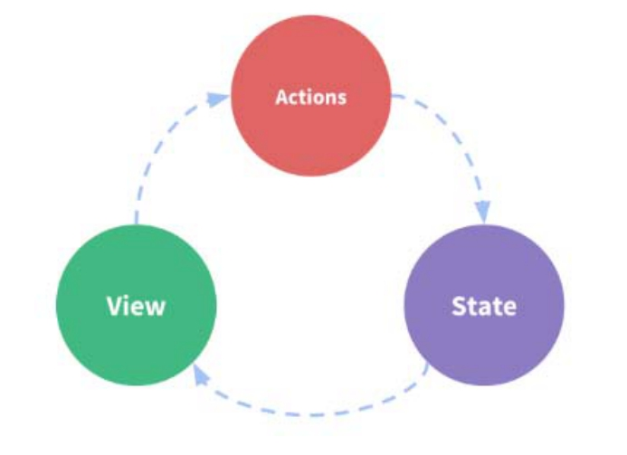

# 第16章　状态管理——Vuex

在前面组件章节中介绍了父子组件之间的通信方法。在实际开发项目中，经常会遇到多个组件需要访问同一数据的情况，且都需要根据数据的变化做出响应，而这些组件之间可能并不是父子组件这种简单的关系。这种情况下，就需要一个全局的状态管理方案。本章将要介绍的Vuex是一个数据管理的插件，是实现组件全局状态（数据）管理的一种机制，可以方便地实现组件之间数据的共享。

## 16.1　什么是Vuex

Vuex是一个专为Vue.js应用程序开发的状态管理模式。它采用集中式存储管理应用的所有组件的数据，并以相应的规则保证数据以一种可预测的方式发生变化。Vuex也集成到Vue的官方调试工具devtools中，提供了诸如零配置的time-travel调试、状态快照导入／导出等高级调试功能。

Vuex是一个专为Vue.js应用程序开发的状态管理模式。状态管理模式其实就是数据管理模式，它集中式存储、管理项目所有组件的数据。

使用Vuex统一管理数据有以下3个好处：

● 能够在Vuex中集中管理共享的数据，易于开发和后期维护。

● 能够高效地实现组件之间的数据共享，提高开发效率。

● 存储在Vuex中的数据是响应式的，能够实时保持数据与页面的同步。

这个状态自管理应用包含以下3个部分：

● state：驱动应用的数据源。

● view：以声明方式将state映射到视图。

● actions：响应在view上的用户输入导致的状态变化。

图16-1是一个表示“单向数据流”理念的简单示意图。



图16-1　单向数据流但是，当应用遇到多个组件共享状态时，单向数据流的简洁性很容易被破坏，将出现以下两个问题：

● 问题1：多个视图依赖于同一状态。

● 问题2：来自不同视图的行为需要变更同一状态。

对于问题1，传参的方法对于多层嵌套的组件将会非常烦琐，并且对于兄弟组件间的状态传递无能为力。

对于问题2，经常会采用父子组件直接引用，或者通过事件来变更和同步状态的多份拷贝。

以上的这些模式非常脆弱，通常会导致无法维护的代码。因此，我们为什么不把组件的共享状态抽取出来，以一个全局单例模式管理呢？在这种模式下，组件树构成了一个巨大的“视图”树，不管在树的哪个位置，任何组件都能获取状态或者触发行为。

通过定义和隔离状态管理中的各种概念，并通过强制规则维持视图和状态间的独立性，代码将会变得更加结构化且易于维护。

这就是Vuex产生的背景，它借鉴了Flux、Redux和The Elm Architecture。与其他模式不同的是，Vuex是专门为Vue.js设计的状态管理库，以利用Vue.js的细粒度数据响应机制来进行高效的状态更新。

## 16.2　安装Vuex

使用CDN方式安装：

```
<!-- 引入最新版本 -->
<script src="https://unpkg.com/vuex@next"></script>

<!-- 引入指定版本 -->
<script src="https://unpkg.com/vuex@next"></script>

```


在使用Vue脚手架开发项目时，可以使用npm或yarn安装Vuex，执行以下命令安装：

```
npm install vuex@next --save

yarn add vuex@next --save
```


安装完成之后，还需要在main.js文件中导入createStore，并调用该方法创建一个store实例，然后使用use()来安装Vuex插件。代码如下：

```
npm install vuex@next --save

yarn add vuex@next --save

```

## 16.3　在项目中使用Vuex

本节讲解在脚手架搭建的项目中如何使用Vuex的对象。

### 16.3.1　搭建一个项目

下面使用脚手架来搭建一个项目myvuex，具体操作步骤说明如下。

（1）使用“vue create sassdemo”命令创建项目时，选择手动配置模块，如图16-2所示。

[插图]

图16-2　手动配置模块

（2）按回车键，进入到模块配置界面，然后通过空格键选择要配置的模块，这里选择“Vuex”来配置预处理器，如图16-3所示。[插图]图16-3　模块配置界面

（3）按回车键，进入选择版本界面，这里选择3.x选项，如图16-4所示。

[插图]图16-4　选择3.x选项

（4）按回车键，进入代码格式和校验选项界面，这里选择默认的第一项，表示仅用于错误预防，如图16-5所示。[插图]图16-5　代码格式和校验选项界面

（5）按回车键，进入何时检查代码界面，这里选择默认的第一项，表示保存时检测，如图16-6所示。[插图]图16-6　何时检查代码界面

（6）按回车键，接下来设置如何保存配置信息，第1项表示在专门的配置文件中保存配置信息，第2项表示在package.json文件中保存配置信息，这里选择第1项，如图16-7所示。

[插图]

图16-7　设置如何保存配置信息

（7）按回车键，接下来设置是否保存本次设置，如果选择保存本次设置，以后在使用vue create命令创建项目时，会出现保存过的配置供用户选择。这里输入“y”，表示保存本次设置，如图16-8所示。[插图]图16-8　保存本次设置

（8）按回车键，接下来为本次配置取个名字，这里输入“mysets”，如图16-9所示。[插图]图16-9　设置本次配置的名字

（9）按回车键，项目创建完成后，结果如图16-10所示。[插图]图16-10　项目创建完成项目创建完成后，目录结构中会出现一个store的文件夹，文件夹中有一个index.js文件，如图16-11所示。


[插图]图16-11　src目录结构index.js文件的代码如下：

```javascript
import {createStore} from 'vuex'

export default createStore({
    state: {},
    getters: {},
    mutations: {},
    actions: {},
    modules: {}
})
```


### 16.3.2　state对象

在上面myvuex项目中，可以把共用的数据提取出来，放到状态管理的state对象中。创建项目时已经配置了Vuex，所以直接在store文件夹下的index.js文件中编写即可，代码如下：[插图]在HelloWorld.vue组件中通过this.$store.state.xxx可以获取state对象的数据。修改HelloWorld.vue的代码如下：

```html
<template>
  <div class="hello">
    <h1>商品名称：{{ name }}</h1>
    <h1>商品价格：{{ price }}</h1>
  </div>
</template>

<script>
export default {
  name: 'HelloWorld',
  props: {
    msg: String
  },
  computed: {
    name() {
      return this.$store.state.name
    },
    price() {
      return this.$store.state.price
    }
  }
}
</script>
```

使用“cd mydemo”命令进入到项目，然后使用脚手架提供的“npm run serve”命令启动项目，项目启动成功后，会提供本地的测试域名，只需要在浏览器中输入http://localhost:8080/，即可打开项目，如图16-12所示。

 

图16-12　访问state对象

### 16.3.3　getter对象

有时候组件中获取到store中的state数据后，需要对其进行加工后才能使用，computed属性中就需要用到写操作函数，如果有多个组件中都需要进行这个操作，那么在各个组件中都要写相同的函数，这就非常地麻烦。

这时可以把这个相同的操作写到store中的getters对象中。每个组件只要引用getter就可以了，非常方便。getter就是把组件中共有的对state的操作进行了提取，它相当于是state的计算属性。getter的返回值会根据它的依赖被缓存起来，且只有当它的依赖值发生了改变，才会被重新计算。

> 提示
>
> getter接受state作为其第一个参数。

getters可以用于监听state中的值的变化，返回计算后的结果，这里修改index.js和HelloWorld.vue文件。修改index.js文件的代码如下：

```js
export default createStore({
    state: {
        name: "洗衣机",
        price: 8600
    },
    getters: {
        getterPrice(state){
            return state.price += 300
        }
    },
    mutations: {},
    actions: {},
    modules: {}
})
```


修改HelloWorld.vue的代码如下：

```html
<template>
  <div class="hello">
    <h1>商品名称：{{ name }}</h1>
    <h1>商品涨价后的价格：{{ getPrice }}</h1>
  </div>
</template>

<script>
export default {
  name: 'HelloWorld',
  props: {
    msg: String
  },
  computed: {
    name() {
      return this.$store.state.name
    },
    price() {
      return this.$store.state.price
    },
    getPrice() {
      return this.$store.getters.getterPrice
    }
  }
}
</script>
```

重新运行项目，价格增加了300，效果如图16-13所示。[插图]


图16-13　getter对象

与state对象一样，getters对象也有一个辅助函数mapGetters，它将store中的getter映射到局部计算属性中。首先引入辅助函数mapGetters：

```
import { mapGetters } from 'vuex'
```

例如上面代码可简化为：

```
mapGetters(
	'varyFrames'
)
```

如果想将一个getter属性另取一个名字，可以使用对象形式：

```
mapGetters(
	[
		veryFramesOne: 'varyFrames'
	]
)
```

### 16.3.4　mutation对象

修改Vuex的store中的数据，唯一方法就是提交mutation。Vuex中的mutation类似于事件。每个mutation都有一个字符串的事件类型（type）和一个回调函数（handler）。这个回调函数就是实际进行数据修改的地方，并且它会接受state作为第一个参数。

我们修改一下上一小节的示例，在项目中添加2个<button>按钮，修改的数据将会渲染到组件中。

修改index.js文件的代码如下：

```
import {createStore} from 'vuex'

export default createStore({
    state: {
        name: "洗衣机",
        price: 8600
    },
    getters: {
        getterPrice(state){
            return state.price += 300
        }
    },
    mutations: {
        addPrice(state, obj) {
            return state.price += obj.num;
        },
        subPrice(state, obj) {
            return state.price -= obj.num;
        }
    },
    actions: {},
    modules: {}
})
```

修改HelloWorld.vue的代码如下：

```html
<template>
  <div class="hello">
    <h1>商品名称：{{ name }}</h1>
    <h1>商品的最新价格：{{ price }}</h1>
    <button @click="handlerAdd()">涨价</button>
    <button @click="handlerSub()">降价</button>
  </div>
</template>

<script>
export default {
  name: 'HelloWorld',
  props: {
    msg: String
  },
  computed: {
    name() {
      return this.$store.state.name
    },
    price() {
      return this.$store.state.price
    },
    getPrice() {
      return this.$store.getters.getterPrice
    }
  },
  methods: {
    handlerAdd() {
      this.$store.commit("addPrice", {
        num: 100
      })
    },
    handlerSub() {
      this.$store.commit("subPrice", {
        num: 100
      })
    }
  }
}
</script>
```

重新运行项目，当单击“涨价”按钮，商品价格增加100；当单击“降价”按钮，商品价格减少100。效果如图16-14所示。

 

图16-14　mutation对象

### 16.3.5　action对象

action类似于mutation，不同之处如下：

● action提交的是mutation，而不是直接变更数据状态。

● action可以包含任意异步操作。

在Vuex中提交mutation是修改状态的唯一方法，并且这个过程是同步的，异步逻辑都应该封装到action对象中。

action函数接受一个与store实例具有相同方法和属性的context对象，因此可以调用context.commit来提交一个mutation，或者通过context.state和context.getters来获取state和getters中的数据。

继续修改上面示例项目，使用action对象执行异步操作，单击按钮后，异步操作在3秒后执行。修改index.js文件的代码如下：

```js
import {createStore} from 'vuex'

export default createStore({
    state: {
        name: "洗衣机",
        price: 8600
    },
    getters: {
        getterPrice(state){
            return state.price += 300
        }
    },
    mutations: {
        addPrice(state, obj) {
            return state.price += obj.num;
        },
        subPrice(state, obj) {
            return state.price -= obj.num;
        }
    },
    actions: {
        addPriceasy(context) {
            setTimeout(() => {
                context.commit("addPrice", {
                    num: 100
                })
            }, 3000)
        },
        subPriceasy(context) {
            setTimeout(() => {
                context.commit("subPrice", {
                    num: 100
                })
            }, 3000)
        }
    },
    modules: {}
})
```

修改HelloWorld.vue的代码如下：

```html
<template>
  <div class="hello">
    <h1>商品名称：{{ name }}</h1>
    <h1>商品的最新价格：{{ price }}</h1>
    <button @click="handlerAdd()">涨价</button>
    <button @click="handlerSub()">降价</button>
    <button @click="handlerAddasy()">异步涨价（3秒后执行）</button>
    <button @click="handlerSubasy()">异步降价（3秒后执行）</button>
  </div>
</template>

<script>
export default {
  name: 'HelloWorld',
  props: {
    msg: String
  },
  computed: {
    name() {
      return this.$store.state.name
    },
    price() {
      return this.$store.state.price
    },
    getPrice() {
      return this.$store.getters.getterPrice
    }
  },
  methods: {
    handlerAdd() {
      this.$store.commit("addPrice", {
        num: 100
      })
    },
    handlerSub() {
      this.$store.commit("subPrice", {
        num: 100
      })
    },
    handlerAddasy() {
      this.$store.dispatch("addPriceasy")
    },
    handlerSubasy() {
      this.$store.dispatch("subPriceasy")
    }
  }
}
</script>
```

重新运行项目，页面效果如图16-15所示。单击“异步降价（3秒后执行）”按钮，可以发现页面会延迟3秒后减少100。

 

图16-15　action对象

## 16.4　疑难解惑

疑问1：Vuex和单纯的全局对象有什么不同？

Vuex和单纯的全局对象有以下两点不同：

（1）Vuex的状态存储是响应式的。当Vue组件从store中读取数据的时候，如果store中的状态发生变化，那么相应的组件也会相应地得到高效更新。

（2）不能直接改变store中的数据。改变store中数据的唯一途径就是显式地提交（commit）mutation。这样使得可以方便地跟踪每一个数据的变化，从而能够实现一些工具以帮助我们更好地了解应用。

疑问2：什么情况下使用Vuex？

Vuex可以帮助我们管理共享数据，并附带了更多的概念和框架。这需要对短期和长期效益进行权衡。

如果不打算开发大型单页应用，使用Vuex可能是烦琐冗余的。如果你的应用够简单，最好不要使用Vuex，一个简单的store模式就足够了。但是，如果需要构建一个中大型单页应用，那么可能要考虑如何更好地在组件外部管理数据，Vuex将会成为自然而然的选择。

一般情况下，只有组件之间共享的数据，才有必要存储到Vuex中，对于组件中的私有数据，一般存储在组件自身的data选项中即可。


# END


