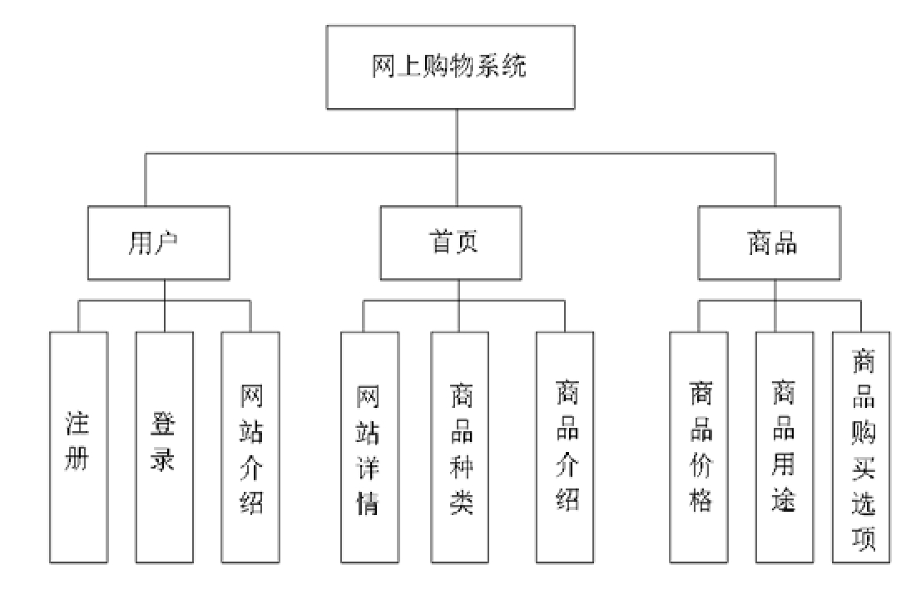

# 第17章　网上购物商城开发实战

本章将利用Vue框架开发一个网上购物商城系统。该商城主要售卖的商品为电器，并提供用户的注册和登录功能。商城的商品页包括对商品的介绍、特色、适用人群的说明，用户可以根据商品的介绍选择适合自己的商品，进行下单购买、支付操作。该系统设计简洁、易于操作、代码可读性强。

## 17.1　系统功能结构

在设计系统的时候，根据系统的需求添加所需要的功能。因此本节介绍的数据流图是一种图形化的设计技术，通过数据流图可以清晰地看到设计的软件中所描绘的信息流和数据流之间的相互转换的过程。数据流图只需要考虑系统必须完成的基本逻辑功能，完全不用考虑怎样具体地实现这些功能。

网上购物商城系统的业务流程如图17-1所示。

图17-1　网上购物商城系统的业务流程图

## 17.2　系统结构分析

根据系统的业务流程图，在程序的构造过程中，形成了如图17-2所示的整体结构。

图17-2　整体结构图

针对文件中的配置进行如下解释：

（1）build文件是webpack的打包编译配置文件。

（2）config文件夹存放的是一些配置项，比如服务器访问的端口配置等。

（3）node_modules是安装Node后，用来存放包管理工具的下载安装包的文件夹。比如webpack、gulp、grunt这些工具。package.json是项目配置文件。

（4）src为项目主目录。

（5）static为vue项目的静态资源。

（6）index.html整个项目的入口文件，将会引用根组件。

## 17.3　系统运行效果

打开“DOS系统”窗口，使用cd命令进入购物商城的系统文件夹shopping，然后执行“npm run serve”命令，如图17-3所示。

[插图]

图17-3　执行“npm run serve”命令

接着会跳转出如图17-4所示的页面。

[插图]

图17-4　系统成功运行

把网址复制到浏览器地址栏中打开，就能访问到本章开发的网上购物系统。

## 17.4　系统功能模块设计与实现

根据系统需求，本节将对系统中的各个模块进行详细说明，并对模块的构成和模块中的代码进行分析。

### 17.4.1　首页模块

下面展示了在网上商品售卖系统中首页所显示的各种商品的信息，关于系统的产品说明、最新发布的消息、销售商品的展示。在系统的左上角有返回首页的标志、右上角有关于新用户的注册和登录，以及“关于”网站的介绍。左上角的“小房子”是返回首页的按钮，如图17-5所示。

[插图]

图17-5　系统首页图

程序中登录、注册和“关于”的相关操作的文件是App.vue，核心代码如下：

[插图]

### 17.4.2　首页信息展示模块

下面主要针对首页信息展示模块进行介绍，首页内容主要包括“全部产品”模块、“热销产品”模块以及产品分类信息展示模块等，如图17-6所示。

[插图]

图17-6　系统首页信息图

首页信息展示的文件为mock.js，其核心代码如下所示：

[插图]

### 17.4.3　用户登录模块

当用户使用商品购物平台时，首先需要注册、登录，拥有账号之后进行购买。登录模块如图17-7所示，单击首页右上角的登录，打开登录页面，输入已经注册的用户名和密码。输入错误则提示重新进行输入。

[插图]

图17-7　用户登录图

实现登录页面所用到的代码如下所示：

[插图]

### 17.4.4　商品模块

在首页的信息展示区，可以看到有四类商品的介绍所对应的代码包，如图17-8所示，下面选择其中显示器商品的analysis.vue模块进行说明。

[插图]

图17-8　商品模块代码文件图

在首页单击进行购买的按钮后，进入到商品的介绍界面（本节针对显示器商品模块进行介绍），针对商品给出分类、价格、说明、视频讲解等多方面的介绍。当用户选择好购买的商品时，可以针对自己的需求，确定相应的商品类型、产品颜色、售后时间、产品尺寸等信息后进行购买，如图17-9所示。

[插图]

图17-9　商品介绍图

显示器商品模块的实现文件是analysis.vue，其核心代码如下：

[插图]

### 17.4.5　购买模块

当用户浏览网站选择好自己所要购买的商品并单击“立即购买”之后，会出现如图17-10所示的窗口。

[插图]

图17-10　购买付款图

购买模块中银行卡支付的代码如下所示：

[插图]

### 17.4.6　支付模块

可以选择多种银行卡的支付方法，单击确认购买之后，会出现17-11所示的窗口。提示用户查看自己的支付状态，以确认是否支付成功还是支付失败。

[插图]

图17-11　支付状态图

用户是否支付成功模块的代码，如下所示：

[插图]

至此，完成了网上购物商城系统的前端开发工作。

# END

